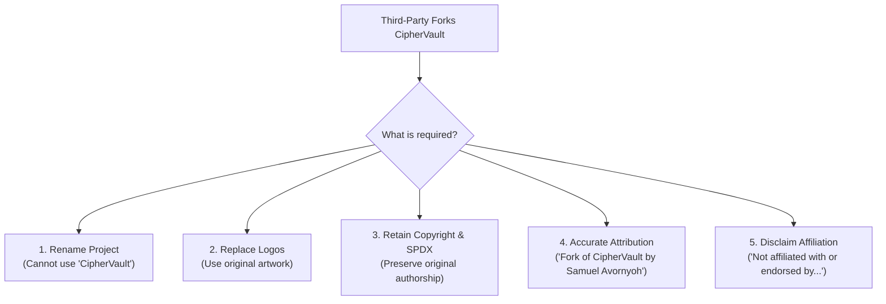

# CipherVault Trademark & Brand Policy

**Effective Date:** September 26, 2026  
**Project Maintainer:** Samuel Avornyoh and the CipherVault Core Team  
**Official Repository:** [https://github.com/samuel-1-avson/CipherVault](https://github.com/samuel-1-avson/CipherVault)

---

## 1. Purpose and Philosophy

CipherVault is an open-source decentralized multi-party secret governance and threshold cryptographic protocol. While the underlying source code is made freely available under open-source software licenses ([MIT](file:///c:/Users/samue/OneDrive/Desktop/projects/CipherVault/LICENSE-MIT) and [Apache 2.0](file:///c:/Users/samue/OneDrive/Desktop/projects/CipherVault/LICENSE-APACHE)), **open-source copyright licenses grant rights to code—they do not grant rights to trademarks, brand identity, logos, or project reputation.**

This Trademark & Brand Policy exists to:
1. Prevent bad actors from taking the codebase, wrapping or cloning it, and falsely claiming they are the creators or official custodians of CipherVault.
2. Prevent public confusion regarding what is an official CipherVault release versus a third-party modification or fork.
3. Protect users from malicious builds, backdoored nodes, or phishing services claiming to be "official CipherVault" software.
4. Preserve the integrity, trust, and community reputation built around the CipherVault project.

---

## 2. Protected Marks

The following assets are the protected trademarks and proprietary brand assets of Samuel Avornyoh and the CipherVault project (the **"CipherVault Marks"**):

* **Word Marks:**
  * `CipherVault`
  * `CipherVault Network`
  * `CipherVault Protocol`
  * `CipherVault Guardian`
  * `CipherVault Operator`
  * `CipherVault CLI` / `CipherVault TUI`
* **Logos and Visual Identity:**
  * The official CipherVault shield / vault emblem, logomarks, favicon, and brand color palette.
* **Domains & Registries:**
  * Official domains (including `ciphervault.org`, `ciphervault.io`, and associated subdomains).
  * Canonical package registry names on crates.io, Docker Hub, GitHub Packages, and npm registered under `ciphervault`.

---

## 3. Permitted Uses (No Written Permission Required)

You may use the CipherVault name without prior written consent under the following strict conditions:

### 3.1. Factual and Nominative Reference
You may use the word mark "CipherVault" in text to factually describe compatibility, integrations, or the technological origin:
* **Acceptable:**
  * *"A monitoring dashboard for CipherVault nodes."*
  * *"Python client compatible with the CipherVault RPC API."*
  * *"How to deploy a CipherVault operator cluster on AWS."*
* **Unacceptable:**
  * *"CipherVault Dashboard"* (implies it is an official CipherVault product).
  * *"Official CipherVault Python Client"*.

### 3.2. Community, Educational, and Research Discussion
You may refer to CipherVault in:
* Academic papers, research articles, security audits, and cryptographic reviews.
* Blog posts, tutorials, conference presentations, and technical documentation.
* Links directly pointing to the official CipherVault repository or documentation.

---

## 4. Prohibited Uses (Prior Written Permission Required)

Unless you have explicit, written authorization from Samuel Avornyoh, you **may not**:

1. **Brand Forks or Clones as "CipherVault":** You may not name any fork, repackaging, binary distribution, or derivative software "CipherVault", or use any confusingly similar name (e.g., *CipherVault Pro*, *CipherVault Enterprise*, *CipherVault Prime*, *CVault*).
2. **Use the Official Logo on Unofficial Software:** You may not attach the CipherVault logo or modified variants of the logo to third-party software binaries, websites, or documentation in a way that suggests affiliation or endorsement.
3. **Run Hosted or Cloud Services Under the Name:** You may not offer hosted, managed, or SaaS products under the name "CipherVault" (e.g., *CipherVault Cloud*, *CipherVault Hosted Nodes*).
4. **Squat or Impersonate on Registries:** You may not register package names, container repositories, domains, or social media handles containing "CipherVault" to deceive users into believing your account represents the official project.
5. **Falsely Claim Ownership:** You may not clone or copy the CipherVault codebase and state, advertise, or imply that you or your organization conceived, authored, or holds exclusive proprietary rights to the original project.

---

## 5. Requirements for Forks and Derivative Works

One of the great strengths of open source is the freedom to fork and build upon existing technology. If you exercise your open-source rights to fork or distribute modified versions of CipherVault, you **must adhere to all of the following rules**:

1. **Rebrand the Software:** You must choose a completely distinct project name and design distinct visual logos.
2. **State Relationship Accurately:** You must state clearly and conspicuously on your repository, landing page, and documentation:
   > *"This software is an independent fork/derivative of the CipherVault project, originally created by Samuel Avornyoh. This project is not affiliated with, sponsored by, or endorsed by the CipherVault project or its maintainers."*
3. **Preserve Copyright and License Notices:** You must preserve all original copyright notices, license texts, and SPDX identifiers in every source code file as required by the MIT and Apache 2.0 licenses.
4. **Do Not Claim Upstream Endorsement:** You may not present your fork as an "upgrade", "official continuation", or "certified enterprise edition" of CipherVault without written consent.

---

## 6. How Trademark Rights Are Enforced

The CipherVault project actively monitors public code repositories, package managers, and social media platforms for unauthorized trademark use and brand confusion.

If an unauthorized fork or product infringes on the CipherVault Marks or deceives users:
1. We will issue an informal request to rebrand and remove confusing trademarks.
2. If unaddressed, we will submit formal **Trademark Infringement Notices** and **DMCA Copyright Management Information (CMI) Takedown Notices** under 17 U.S.C. § 1202 to the hosting platform (GitHub, Docker Hub, crates.io, cloud providers).
3. If necessary, legal counsel will pursue formal trademark protection and injunctive relief to prevent unfair competition and user deception.

---

## 7. Inquiries and Permission Requests

If you are developing a commercial integration, hardware module, or community initiative and wish to seek written permission or verify compliance with this policy, please open a discussion or contact:

* **Project Lead:** Samuel Avornyoh
* **Contact:** Open an inquiry via [GitHub Discussions](https://github.com/samuel-1-avson/CipherVault/discussions) or private security/contact channel.
