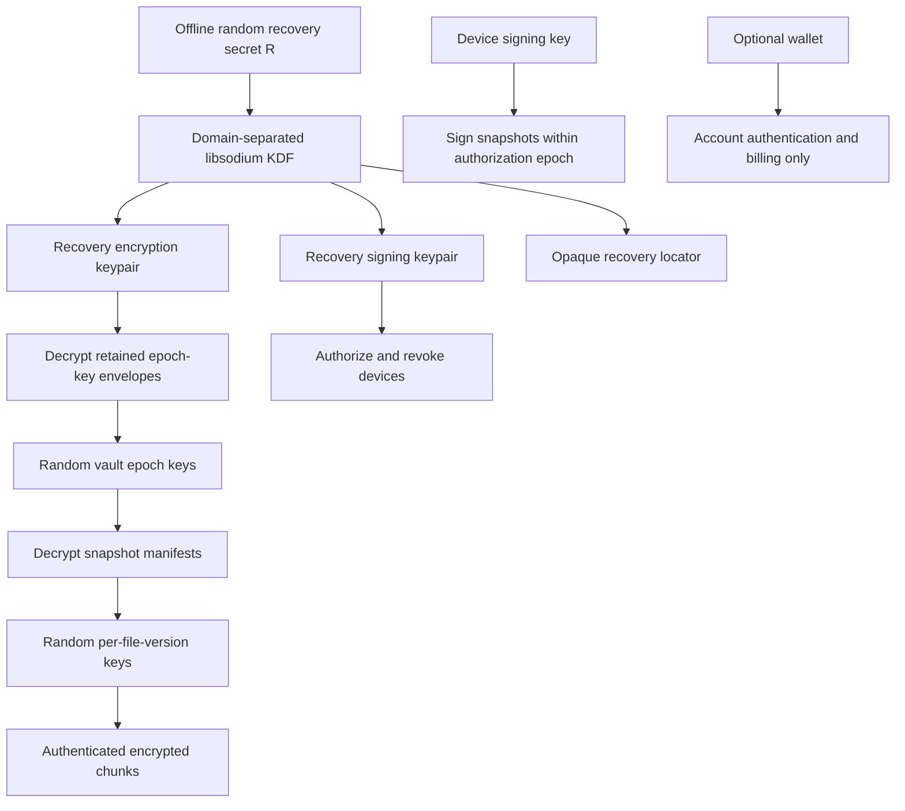

# 03 — Security and recovery

This is a proposed protocol composition using established primitives. It is not an audited cryptographic protocol. Independent review of the complete format, key lifecycle, recovery paths and implementation is a release gate.

## Assets, adversaries and boundaries

Protect confidential file contents, filenames, secret histories, decryption keys, recovery authority, version integrity and recoverability. Wallet balances and external credential validity are adjacent assets, not services this backup system guarantees.

| Adversary / failure | Intended defense | Residual limit |
|---|---|---|
| Passive network observer | TLS and client-side encryption | Sees endpoints, timing and volume; anonymity is not promised |
| Curious or malicious storage operator | Ciphertext only; authenticated chunks and signed manifests | Can retain, withhold, correlate, lie about retention or collude |
| Compromised coordinator | No keys; portable signed records; direct operators | Can censor scheduling, leak account metadata, drain its own budget or delay new writes |
| One failed operator | Three independent full copies and active repair | Correlated infrastructure or all-operator failure still defeats availability |
| Stolen locked laptop | OS protection and locked key store | Weak OS login, memory capture, unlocked sessions and endpoint malware defeat this boundary |
| Malware on unlocked developer machine | Immutable old history, separated recovery authority, retention lock | Can read current plaintext/keys and submit malicious new versions; backup cannot prevent exfiltration |
| Stolen wallet | Wallet does not decrypt or authorize vault destruction | Attacker may spend wallet funds or disrupt linked billing |
| Stolen recovery kit | Physically separated kit storage; optional encrypted digital copy | The kit is ultimate authority; possession can expose the whole retained vault |
| Lost recovery kit and all authorized devices | None | Cryptographically unrecoverable |
| Replay or split view | Signed ancestry, independent head comparison, on-chain checkpoints | Newest unanchored data can be hidden; fresh state cannot be proved during complete isolation |
| Malicious update / dependency | Signed builds, review, narrow dependencies, reproducibility | A trusted malicious client can steal plaintext; signatures alone do not prove benign code |
| Future crypto break | Versioned algorithms and migration plan | Already retained ciphertext may become vulnerable; no retroactive secrecy guarantee |

Trust boundaries are (1) the local plaintext/OS boundary, (2) the encrypted network boundary, (3) each independently controlled operator, (4) the optional coordinator, (5) public chain/RPC/governance, and (6) offline recovery storage. Never place recovery shares and operators under the same administrative credentials and count them as independent.

## Key hierarchy

Generate `R` as 32 cryptographically random bytes locally. Encode it with a version and transcription checksum in the recovery kit; do not invent a mnemonic-word standard in the implementation. Derive separate seeds/keys through libsodium's KDF with fixed registered eight-byte contexts and subkey IDs. The exact constants and test vectors must be frozen in the format specification. Derive recovery Ed25519 signing and X25519 encryption keypairs from distinct seeds; derive a separate unpredictable locator. Never derive any of these from a wallet signature, wallet address, email, project name, or human password.

Create random 32-byte vault epoch key `V_e`. Recovery envelopes encrypt `V_e` to the recovery X25519 public key with libsodium sealed boxes. Their encrypted payload binds format version, vault ID, epoch and purpose. The containing envelope is signed by a device currently authorized to create that epoch, or by the recovery authority. Sealed boxes alone do not authenticate the sender. This public-key wrap allows an authorized device to rotate to a fresh epoch without keeping `R` online.

The ordinary device holds only its device signing key and the epoch keys it needs, protected by the OS credential facility and an explicit unlocked session. It does not retain `R` or the recovery signing private key after enrollment. Recovery signing authorizes device certificates and authority changes. Encryption and signing keypairs are never interchanged. A newly recovered device can recover historical epochs from envelopes, but a newly invited device need not receive historical access.

Each changed file version gets a fresh random data key. Split into proposed 1 MiB plaintext chunks; each uses XChaCha20-Poly1305 with a fresh random 24-byte nonce. Associated data binds protocol version, vault ID, random file-version ID, chunk index, total count, declared padded length and key epoch. Authenticate exact plaintext lengths and full-file digest inside the encrypted manifest. Never reuse a nonce/key pair. Reusing an existing immutable ciphertext chunk is permitted; re-encrypting modified data requires new randomness.

Use an epoch-derived, purpose-separated manifest key to encrypt each snapshot manifest under a fresh nonce. It contains paths, file lengths, permissions, per-file-version keys, ciphertext chunk IDs and the ordered file list. The outer signed snapshot binds the encrypted manifest digest, parents, writer certificate, epoch and sequence. This binds the file keys to the snapshot and prevents cross-vault/object substitution. Decrypt each chunk only after authenticating it, keep output in restrictive staging files, and publish the completed file only after verifying its complete authenticated assembly.

Algorithm choices are based on libsodium's [AEAD guidance](https://doc.libsodium.org/secret-key_cryptography/aead/chacha20-poly1305), [key derivation](https://doc.libsodium.org/key_derivation) and [sealed boxes](https://doc.libsodium.org/public-key_cryptography/sealed_boxes). Independent review must verify the composition, not merely the primitives.

## Password and device protection

The printed random recovery secret is the default. An optional password-encrypted digital kit must use Argon2id with a random salt, stored explicit parameters and a versioned envelope, not a direct password hash as a key. Benchmark a provisional 256 MiB memory budget and roughly 500 ms derivation target on supported recovery hardware, with an explicitly weaker compatibility profile only after review. Bound parameters before allocating memory to avoid denial of service. Human password strength remains a limit; the password and encrypted kit must both survive device loss. Libsodium documents its [password-hashing interface and parameter handling](https://doc.libsodium.org/password_hashing/default_phf).

An OS key store protects unattended local state, not an actively compromised endpoint. Avoid putting keys into command-line arguments, environment variables, clipboard history, application logs or crash uploads. Minimize secret copies and zeroize buffers where practical, while documenting limits from swapping, hibernation, runtime copies and kernel access. Full-disk encryption and account security remain host responsibilities.

## Recovery kit and bootstrap

The kit contains the secret `R` and non-secret vault/bootstrap descriptor: format version, vault ID, recovery public-key fingerprints, signed genesis descriptor digest, chain/network identity and checkpoint contract version/address when present, at least three operator identity keys and endpoints, protocol documentation fingerprint, and an initial checkpoint reference. It also documents how to obtain and verify a compatible restore binary independently of the company's website. Store encrypted digital export plus human-readable emergency instructions in two different physical locations.

The locator identifies append-only recovery records at operators. It is not a decryption password, and operators that see it can correlate records. Each operator supports challenge-response recovery authentication against the registered recovery signing key. Billing credentials are not required to read retained ciphertext through this path. The storage agreement must include a bounded emergency retrieval allowance; accounts must not lose paid-up data solely because a coordinator session expired.

Every committed snapshot replicates its recovery closure: encrypted chunks, manifest, epoch envelopes, signed authorization chain, retention receipts, signed locator/head records and checkpoint evidence when available. A missing envelope is as serious as a missing file. Operator lists can change through signed migration records; preserve overlap with old endpoints and refresh the offline public kit. Static paper endpoints cannot follow an arbitrary number of vanished providers. At least one kit bootstrap route or independently known authentic update path must survive. This residual dependency is tested and disclosed.

## Total-device-loss procedure

1. Obtain the signed standalone restore client on a clean replacement machine. Verify it against an independently preserved release trust root; a compromised download page is insufficient evidence.
2. Load the kit locally. Validate checksums, format bounds, recovery public-key fingerprints and genesis binding before contacting any service.
3. Contact multiple kit-listed operators directly; answer their nonce challenges with the recovery signing key. Fetch all signed head candidates, envelopes and authorization histories.
4. Compare ancestry and authorization generations. Consult independently sourced chain state for anchored history when reachable. Display competing heads and stale evidence. Never choose the largest unauthenticated timestamp.
5. Select a known-good snapshot. Recover its epoch key, decrypt its manifest, retrieve and hash-check encrypted chunks, authenticate/decrypt, then stage a complete restore to a new directory.
6. Verify file digests and supported permissions. Generate a local report with no secret values. If latest freshness cannot be established, permit explicit older restore while labeling that uncertainty.
7. Create a new device signing key and authorize it with the recovery authority. After theft or suspected compromise, revoke the old device, rotate vault epoch keys and rotate external credentials at their issuers as appropriate.
8. Refresh recovery metadata and test the new configuration. Remove recovery private material from the ordinary online session to the extent the platform permits.

If both recovery material and every authorized decryption device are lost, stop: account support, the wallet, chain validators and storage operators cannot decrypt. If all ciphertext copies expired, the kit alone cannot reconstruct them.

## Rotation and revocation

Routine new-device enrollment requires existing recovery authorization, not just a wallet login. Revocation increments a signed authorization generation. Operators reject newly submitted records from revoked devices after learning the update; offline/inconsistent operators may lag. Record receipt and checkpoint times instead of claiming instantaneous global revocation.

Rotate epoch keys for future snapshots after compromise. Retain old epoch envelopes only as long as historical restore is intended. Rewrapping an old data key does not remove access held by someone who already copied that key. Re-encrypting all retained content produces new ciphertext, but cannot delete old copies in an adversary's possession. For external API keys and wallet keys, rotate or transfer authority in their original systems; backup-key rotation is not credential revocation.

Rotating the recovery secret requires a new recovery authority, re-enveloping required epoch keys, a signed authority transition replicated to all operators, kit replacement and a clean-machine test. If the old recovery secret was stolen, assume historical content is exposed. Resolve competing authority transitions explicitly; no timestamp-only tie breaker can establish who was the legitimate human.

## Ransomware and rollback

Ordinary device credentials may append snapshots but cannot shorten prepaid retention or immediately purge history. Keep a minimum 90-day immutable-retention policy at each operator. Destructive policy changes require recovery authority and a proposed seven-day delay, with alerts through independent channels if configured. The delay cannot stop a malicious operator itself from deleting data; independent copies are the defense.

Detect unusual change volume locally and offer a pause, but do not call this malware detection. Preserve last-known-good snapshots. A legitimately signed encrypted ransomware version remains a valid new snapshot; signatures prove its origin, not its desirability. Authentic old snapshots remain recoverable even when newer data is bad. Chain commitments do not identify which contents are good.

## Threshold Guardian Recovery ($M$-of-$N$) — Implemented

Threshold Guardian Recovery has been implemented and audited using Shamir's Secret Sharing over $\text{GF}(2^8)$ with constant-time inversion ([`crates/crypto/src/shamir.rs`](file:///c:/Users/samue/OneDrive/Desktop/projects/CipherVault/crates/crypto/src/shamir.rs)). 

Key operational parameters:
- **Scope**: Splits exclusively the 32-byte offline master recovery secret ($R$). Individual guardians never receive file decryption keys, manifests, or remote object storage credentials.
- **Algebraic Construction**: Polynomial evaluation over $\text{GF}(2^8)$ with irreducible generator $x^8 + x^4 + x^3 + x + 1$ (0x11B). Lagrange basis polynomial interpolation executes in constant-time to resist timing side-channels.
- **Execution Boundary**: All split and reconstruction ceremonies execute strictly on the user's local machine via `ciphervault recovery split --threshold M --shares N` and `ciphervault recovery combine --shares ...`. No share material is ever transmitted to operators or coordinator networks.
- **Defense in Depth**: Any $M$-of-$N$ threshold of authentic shares can reconstruct the vault master key, while $M-1$ shares reveal zero mathematical information regarding the key. Test regressions in `crates/crypto/tests/shamir_test.rs` and `apps/cli/tests/chaos_federation_drill.rs` verify recovery across multi-share combinations and reject corrupted shares.
