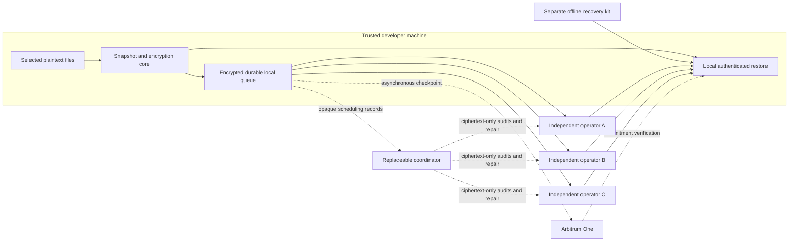

# 04 — Architecture and storage

## Components and data flow

The client captures and encrypts bytes. Operators retain immutable encrypted objects and signed control records. The coordinator may schedule uploads, renewals, repair and anchoring, but never sees file keys or paths. A standalone restore tool implements the same documented format without a coordinator login. An operator's Kubo API is private; a narrowly scoped product API handles client uploads, leases and recovery.

## Snapshot commit protocol

1. Capture selected files consistently enough for regular-file backup. Reject unsupported files and unstable reads. Generate changed-file ciphertext, encrypted manifest and signed snapshot record locally.
2. Write the encrypted queue transaction and fsync appropriate files/database state. Report `local` only now. A power cut must either leave a recoverable queue or no claimed local success.
3. Upload the complete object closure to all three operators in parallel with bounded concurrency. Reuse only previously committed immutable objects already covered by renewed leases. Uploads are idempotent by content ID.
4. Each operator verifies object lengths and ciphertext digests, persists and pins every referenced object, and returns a signed lease receipt covering the closure digest, bytes and retention deadline. The closure list is available for repair without revealing filenames or keys.
5. Client independently retrieves the closure from each operator, verifies hashes and signatures, then publishes an append-only signed head record. Operator head acknowledgement includes a matching lease/closure reference. Count an operator only after all required data and discoverability metadata are verified there.
6. Report `remote-durable` once three qualifying operator copies meet the policy. This is a receipt/readback-based operational status, not a cryptographic proof of future durability. Persist receipts to every operator so loss of the local database does not lose evidence.
7. Queue the opaque checkpoint on Arbitrum. Add transaction and finality evidence later; anchoring cannot compensate for missing replicas.

Two-phase publication prevents discoverable heads from pointing at knowingly incomplete uploads. A crash can leave orphan objects; collect them only after a grace period and a reachability scan. If head publication succeeds at only one operator, retry rather than silently counting three complete recovery routes.

## Replication and independence

Store three full ciphertext copies initially. One intact full copy is enough to restore; requiring three verified copies before the normal backup-success status provides margin and makes repair simple. For small secret vaults, avoiding erasure-code metadata and quorum reconstruction is worth extra bytes. This is a design choice, not a measured universal optimum.

Independence requires different administrative owners and credentials, with a reviewed inventory of cloud providers, data centers, regions, networks, billing accounts, DNS, key custody and subcontractors. Two branded services may use the same underlying provider. Avoid counting replicas whose only retrieval gateway is the same company. Document correlated dependencies rather than multiplying independent-failure probabilities without evidence.

The initial network is a curated federation of operators, not a permissionless market. Third parties can implement the documented API, but admission and the verified independence list are initially maintained by the product team and exportable to clients. Users may override providers after reviewing policy. No token staking or Sybil-proof operator identity is claimed.

## Receipts, availability checks and proofs

| Evidence | Establishes | Does not establish |
|---|---|---|
| Upload HTTP success | Endpoint accepted a request | Full persistence or later retrievability |
| Signed retention receipt | Named operator promised a particular ciphertext closure and term | Truthful disk writes, physical independence or future compliance |
| Ciphertext digest match | Returned bytes match the committed object | Decryptability without envelopes and keys |
| Full independent readback | A complete copy was retrievable through that operator at that time | That it was not fetched just-in-time from another operator |
| Random range/chunk retrieval | Sampled bytes could be returned during the test | Complete-file possession or independent replica count |
| Filecoin storage proof | Protocol-specific storage claim under Filecoin assumptions | Application restore latency, manifest completeness or user key survival |
| Chain checkpoint | Commitment was included in observed chain history | Storage, secrecy, good plaintext or current provider liveness |

Do not market sampling as proof-of-replication or build a new proof system for the MVP. Challenge unpredictable chunks, verify against the immutable closure, and periodically download the entire closure. For the initial size limits, full readback is practical enough to measure before optimization. [Filecoin's proof definitions](https://docs.filecoin.io/reference/general/glossary) are useful precisely because their claim differs from an operator receipt.

## Retention, funding and repair

The proposed default is a 90-day minimum version retention period. Each snapshot references a policy ID with earliest deletion time and operator lease deadlines. Extend leases before they enter a 30-day warning window; keep at least 90 days of estimated maintenance funding available when feasible. These are proposals requiring operator contracts and cost validation.

Deletion of a tracked file creates a tombstone in a new snapshot; it does not delete old snapshots. Garbage collection requires expiry, no surviving references and the configured grace period. An offline device returning after expiry must not resurrect deleted data as a new authoritative head without explicit user action. Warn that shorter retention limits ransomware recovery time.

The maintenance service holds bounded credentials to retrieve ciphertext, place copies and renew within a spending cap. It cannot decrypt or purge protected versions. An encrypted or privacy-minimized placement catalog lists CIDs, size, replication target and lease evidence; repair workers need no plaintext manifest. They fetch an intact ciphertext object, verify its digest, upload it to a replacement operator, verify readback and publish a signed placement update. Device/root signatures remain authoritative for snapshot contents; maintenance signatures are authoritative only for placement observations.

Trigger repair when verified replicas fall below three, a lease nears expiry, an operator disappears, or observed corruption occurs. Preserve surviving copies until replacement acknowledgement. If no intact source exists, stop with `data-unavailable`; payment, proofs and signatures cannot reconstruct lost bytes. Budget alerts must surface before expiration. Maintain an export/retrieval grace policy in operator agreements; it is not a guarantee beyond those agreements.

## Recovery discovery without the company

Each operator stores a small append-only vault recovery log keyed by an opaque locator and bound to the recovery public key. It includes genesis, signed authorization transitions, signed snapshot heads, epoch envelopes and current placement descriptors. The recovery kit contains enough static roots to authenticate this log. Operators return all valid branch heads, not just one mutable latest pointer.

Known checkpoint evidence lets a client verify that a head commitment was published; the chain stores no vault ID, locator or full recovery metadata. A commitment by itself cannot locate ciphertext or discover the latest head. Optional public IPFS routing can help find known CIDs if somebody still provides them, but is not the only bootstrap plan. IPFS documents both [retention requirements](https://docs.ipfs.tech/concepts/persistence/) and [routing metadata exposure](https://docs.ipfs.tech/concepts/privacy-and-encryption/).

Provider migration uses overlapping old and new recovery logs and a recovery-authorized or policy-authorized signed endpoint update. Keep old metadata reachable for the agreed overlap term, refresh kit public information and rehearse recovery. Loss of every bootstrap route requires an authentic external descriptor copy; absent that, known keys alone may not find the files. A general decentralized naming network is future research, not silently assumed infrastructure.

## Decentralization scorecard

| Dimension | Proposed MVP | Remaining concentration |
|---|---|---|
| File custody | Three independent operators | Independence must be verified; common software can fail everywhere |
| Key custody | User devices and offline kit only | Human recovery habits and endpoint trust |
| Discovery | Kit roots and replicated logs; optional public routing | Stale kits and common DNS dependencies |
| Coordination | Replaceable coordinator; client direct path | Automatic repair may pause until replacement scheduler starts |
| Payments | Separate operator leases and portable receipts | Billing sponsor outage, fiat rails or wallet funding |
| Verification | Client hashes/signatures, independent retrieval | Physical copy count cannot be proven by this protocol |
| Anchoring | Existing rollup and Ethereum | Sequencer, governance and RPC dependencies |
| Software | Open format and standalone restore package | Signing-key custody and build supply chain |

## Metadata privacy

Encrypt filenames, directory structure, true lengths, timestamps, project labels, content hashes and file keys. Use ciphertext-derived CIDs and random object/file identifiers. Do not use convergent encryption or global plaintext deduplication: low-entropy `.env` values are vulnerable to guessing attacks when identifiers reveal content.

Proposed padding rounds small files to 4 KiB and large final chunks to a documented bucket; store exact lengths only inside encrypted metadata. Disable compression initially. This reduces some size leakage but does not hide object counts, access times, account linkage or churn. Reusing unchanged ciphertext across versions reveals equality to operators; document this local-vault optimization. Re-encrypting every snapshot reduces equality leakage at a storage/bandwidth cost.

No filenames, file hashes of plaintext, wallet secrets, recovery locators, stable vault IDs or CIDs go on-chain. Salted commitments still expose publication timing and may be linked through the payer. Batched roots or relayers can reduce some linkability later, but introduce proof-distribution and censorship dependencies. Do not claim anonymous backup.
