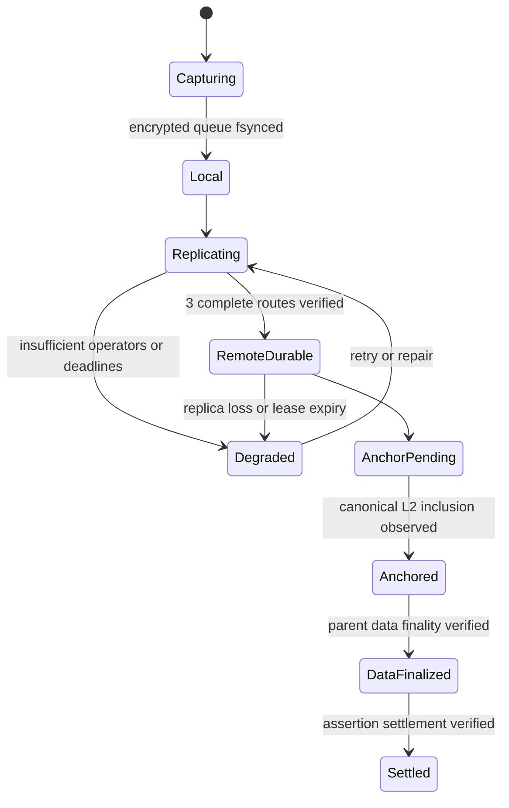

# 05 — Protocol and interfaces

This is an implementable design baseline, not a frozen wire standard. Phase 0 must freeze exact schemas, encoding, size limits, domain-separation strings and test vectors. All examples below describe synthetic placeholders; no example is a real credential.

## Canonical object model

Signed records use a constrained deterministic CBOR profile: fixed field types, integer bounds, canonical key order, no duplicate keys, no floats, no indefinite lengths, explicit extension handling, and reject unknown critical fields. Authenticate the exact canonical bytes with a type-specific domain prefix. Do not sign reserialized untrusted JSON. Schema limits apply before allocations. This profile builds on [RFC 8949](https://datatracker.ietf.org/doc/html/rfc8949).

| Object | Essential fields | Confidentiality / authorization |
|---|---|---|
| Genesis | version, random vault ID, recovery public keys, policy digest, creation nonce | Signed by recovery authority; no paths |
| Device certificate | vault, device signing public key, permissions, authority generation, certificate ID | Recovery-signed; device cannot self-promote |
| Authority transition | prior authority digest, new generation/keys, revoked certificate IDs | Recovery-signed; forks require explicit resolution |
| Epoch envelope | vault, epoch, envelope algorithm, recipient fingerprint, sealed key payload, signer certificate | Key payload encrypted; outer record signed |
| Chunk wire object | format, random nonce, ciphertext and AEAD tag | SHA-256/CID over whole wire bytes; bound AAD reconstructed from manifest |
| Snapshot manifest | file IDs, paths, version IDs, keys, ordered chunks, lengths, hashes, permissions | Encrypted under epoch-derived manifest key |
| Snapshot record | vault, random snapshot ID, parents, device ID, per-device counter, authority generation, epoch, encrypted-manifest CID | Device-signed; timestamp is advisory only |
| Recovery closure | snapshot-record CID, manifest CID, envelope/certificate/history IDs, full required-object list and byte count | Signed digest; visible object graph, no names/keys |
| Lease receipt | operator ID, closure digest, term, policy, bytes, issue time, lease ID | Operator-signed promise; not storage proof |
| Head record | snapshot-record CID, parents, closure digest, device counter, lease IDs | Device-signed, append-only; discoverability entry |
| Placement update | closure/object IDs, provider keys/endpoints, lease/readback evidence, generation | Maintenance-signed within limited policy or recovery-authorized |
| Checkpoint evidence | commitment, random salt, chain/contract identity, transaction/block reference, inclusion evidence | Stored off-chain with closure; no plaintext |

The closure excludes its own digest and later receipts to avoid circular hashes. Define a base closure of data and prerequisite control records. Operator receipts sign that base-closure digest. A final recovery record references the base closure and receipts; replicate this final record and head separately, with explicit acknowledgement before reporting full protection. Checkpoint evidence is appended later and is never required to decrypt.

Proposed limits: 1 MiB plaintext chunks; 256 MiB files; 1 GiB active vault; 10,000 files; 16 MiB decoded manifest; 32 parents maximum; bounded certificate/history pagination. More than these limits returns a named error without partial success. Long histories are streamed and verified incrementally; limits must not make a legitimately retained history unrestorable. Large recovery closures use paginated, hash-linked lists with bounded nodes, specified before implementation.

## Identity and authorization

The recovery signing key is the vault authority. Device certificates authorize append, read and enrollment functions only as specified; MVP enrollment/revocation remains recovery-authorized. Operator challenges include fresh nonce, origin, vault, action, expiry and protocol version. Reject replay and cross-origin reuse. Session capabilities have short expiry, explicit rights, byte limits and vault scope. A maintenance capability permits ciphertext reads, copy placement and capped renewals, never key access or early purge.

Wallet login, if offered, links a billing account using a domain-bound nonce challenge. It neither issues device certificates nor decrypts envelopes. A user with only a new wallet cannot restore; a user with the recovery kit can restore without the old wallet. Billing-key rotation cannot rewrite snapshot authority.

## Operator HTTP API — proposed, not a Kubo standard

| Method / route | Purpose | Preconditions and outcome |
|---|---|---|
| `GET /v1/info` | Operator identity, supported format/limits, retention terms | TLS plus pinned operator identity; signed metadata |
| `POST /v1/challenges` | Obtain scoped authentication challenge | Rate-limited; does not reveal whether an arbitrary vault exists |
| `POST /v1/sessions` | Redeem device/recovery signature | Single-use challenge; returns scoped short-lived capability |
| `PUT /v1/objects/{cid}` | Upload ciphertext object | Digest/size checked; immutable; identical retry succeeds |
| `GET /v1/objects/{cid}` | Retrieve bytes or bounded ranges | Device/repair/recovery capability; client verifies digest |
| `POST /v1/leases` | Commit closure for a retention term | Verify complete closure, quote/spend cap, durable pin; signed receipt |
| `POST /v1/recovery/{locator}/records` | Append signed recovery/control/head record | Verify vault authority and all referenced required objects |
| `GET /v1/recovery/{locator}/records` | Page history and candidate heads | Recovery path independent of coordinator billing session |
| `POST /v1/leases/{id}/renew` | Extend retention | Idempotency key and maximum charge; never silently shorten term |
| `POST /v1/purge-requests` | Request eligible deletion | Recovery signature, delay, lease expiry and reference checks |

Use structured errors such as `AUTH_REVOKED`, `QUOTA_EXCEEDED`, `RETENTION_INSUFFICIENT`, `OBJECT_MISSING`, `HEAD_CONFLICT`, `FORMAT_UNSUPPORTED`, `BUDGET_EXCEEDED`, `INTEGRITY_FAILURE` and `FRESHNESS_UNKNOWN`. Map protocol conflicts to HTTP 409 and malformed data to 400; never treat every 2xx response as remote durability. Separate accepted background jobs from completed leases. Requests carrying signed bodies bind the body digest and method/path to avoid replay on another endpoint. No secrets in URL query strings.

Treat provider URLs as untrusted: constrain schemes/ports, prevent SSRF from coordinator jobs, reject redirects to local/private infrastructure unless explicitly configured for a self-hosted operator, and pin expected identities. Kubo administration remains on a private interface. Adapter implementations must not have a plaintext-upload method; encryption errors abort before network dispatch.

## Offline behavior and conflicts

Use a signed snapshot DAG rather than a global mutable “latest file.” A device maintains a monotonic counter per certificate and parent references. Retry the same captured snapshot ID after network failures; do not create a new version for every upload retry. Encrypt local queue metadata, including paths, and use a transactional outbox so queue state cannot claim completion before receipts are persisted.

Two devices that work offline can produce two valid heads. Preserve both. Fetch, verify and display local-only summaries; require explicit selection or a new snapshot with both parents. Do not automatically text-merge secrets or print a diff containing values. File deletion is an explicit snapshot event. Same device/counter with different signed contents is equivocation and must be surfaced, not resolved by wall-clock time.

Loss of connectivity leaves snapshots `local`. Disk-full or failed fsync returns failure before that status. A previously valid remote snapshot remains valid when the chain is offline; it may be stale. A chain reorganization removes/reduces checkpoint status without deleting file replicas. Clients persist the strongest previously verified checkpoint as a lower bound, but a clean machine with an old kit may lack that latest bound.

## CLI design

```text
ciphervault init
ciphervault track .env config/private.json
ciphervault status
ciphervault push --message "local configuration update"
ciphervault push --background
ciphervault history
ciphervault restore --snapshot SNAPSHOT_ID --to NEW_DIRECTORY
ciphervault verify --snapshot SNAPSHOT_ID --all-providers
ciphervault recovery export
ciphervault recovery test --to EMPTY_DIRECTORY
ciphervault recover --kit OFFLINE_KIT_PATH --to NEW_DIRECTORY
ciphervault devices list
ciphervault devices revoke DEVICE_ID
ciphervault rotate --new-epoch
ciphervault export --encrypted --to EXPORT_DIRECTORY
```

These are proposed commands, not installed software. Recovery secrets are entered at a protected prompt, never as arguments. Snapshot messages are encrypted metadata. Paths in this example are fictional and do not authorize file collection. `status --json` exposes status, counts and timing, excluding secret paths by default. Define exit codes: 0 requested operation reached its requested state, 2 usage, 3 pending/degraded durability, 4 auth/recovery failure, 5 integrity failure, 6 conflict/freshness intervention. A background request can return 0 for queueing only if machine-readable output explicitly says `local` and `remote_durable=false`.

## Minimal checkpoint contract

Choose an immutable, non-custodial commitment registry. Proposed interface: `publish(bytes32 commitment)` records first-seen block number and emits a global sequence/event; duplicate publication is idempotent. Anyone can publish a commitment. The contract does not establish vault authority, latest head, storage truth, or payment entitlement. Those facts are checked from signed off-chain records. This avoids making an old wallet the only way to continue the vault after recovery.

Compute a domain-separated SHA-256 commitment over a fresh 32-byte random salt and the signed head-record digest. Keep salt and corresponding evidence in replicated recovery records. Publishing another person's digest does not grant authority; a bogus root has no valid vault-signed preimage. No vault locator, filename, ciphertext CID, recovery key, file key, stable vault tag, or wallet-derived decryption material is stored in contract inputs. Transaction payer and timing remain public.

This simple choice proves inclusion, not completeness or latestness. The global event sequence is not the vault's authoritative version sequence. Operators can hide a newer unanchored or undiscovered record, and a public opaque commitment cannot reveal which vault it belongs to without the off-chain evidence. Document that limitation in the UI rather than inventing a false freshness guarantee. Later batch aggregation must distribute Merkle inclusion paths independently before claiming a snapshot anchored.

Production transactions may be submitted by a capped relayer or directly by a user, with no decryption privilege. No storage escrow, token, staking, slashing, guardian logic or custom proof verifier in this contract. A relayer outage delays anchoring only. Gas is capped and retries are idempotent. Network/address identity is part of the signed evidence to prevent cross-chain substitution.

Do not deploy an upgrade proxy for v1. A new format/contract is a new version and address, advertised through a recovery-signed migration record with coexistence of old verification. Preserve old readers and histories. Product governance controls recommended versions and relayer operations, not users' decryptability. Underlying rollup governance risk remains separate. Contract tests include duplicate submission, event sequencing, invalid evidence linkage, arbitrary publishers and cost/spam bounds; the registry must never become an unbounded loop over all roots.

## Status state machine



Implementation stores orthogonal fields, not just the diagram's linear state: `local_state`, `replicas_verified`, `lease_deadlines`, `last_full_readback`, `anchor_state`, `freshness_confidence`. An anchored snapshot may simultaneously be storage-degraded. “Finalized” in the UI must say **L1 data finalized** or **assertion settled**; neither means files are permanently stored. Arbitrum describes those separate stages in its [finality documentation](https://docs.arbitrum.io/how-arbitrum-works/deep-dives/finality).

## Proposed repository structure

```text
docs/                 requirements, protocol, threat model, ADRs, runbooks
crates/crypto/        narrow libsodium wrapper and key lifecycle
crates/format/        bounded canonical encoding and object validation
crates/snapshot/      capture, chunking, manifests, DAG
crates/local-store/   encrypted queue and SQLite transactions
crates/storage/       ciphertext-only interfaces and adapters
crates/recovery/      bootstrap, authority, envelopes, standalone verifier
crates/client-core/   workflows and policy state machine
apps/cli/             developer commands
apps/agent/           optional watcher and background upload
services/operator/   retention API over Kubo
services/coordinator/ jobs, billing integration, metadata only
services/maintenance/ ciphertext auditing, repair and renewals
contracts/            immutable checkpoint registry and Foundry tests
tests/fixtures/       synthetic public vectors only
tests/recovery/       clean-machine and coordinator-loss drills
tests/adversarial/    fuzz, fault injection, malicious-provider tests
packaging/            signed releases, SBOM and restore distribution
```

Enforce dependency direction: UI → client core → format/crypto/storage; operator/coordinator must not depend on decryption workflows. Security ownership belongs to crypto/recovery maintainers; storage owners implement retention evidence; client owners own truthful state reporting. Assign named people before implementation. This is a new repository; no CREG modules are implicitly reused.
