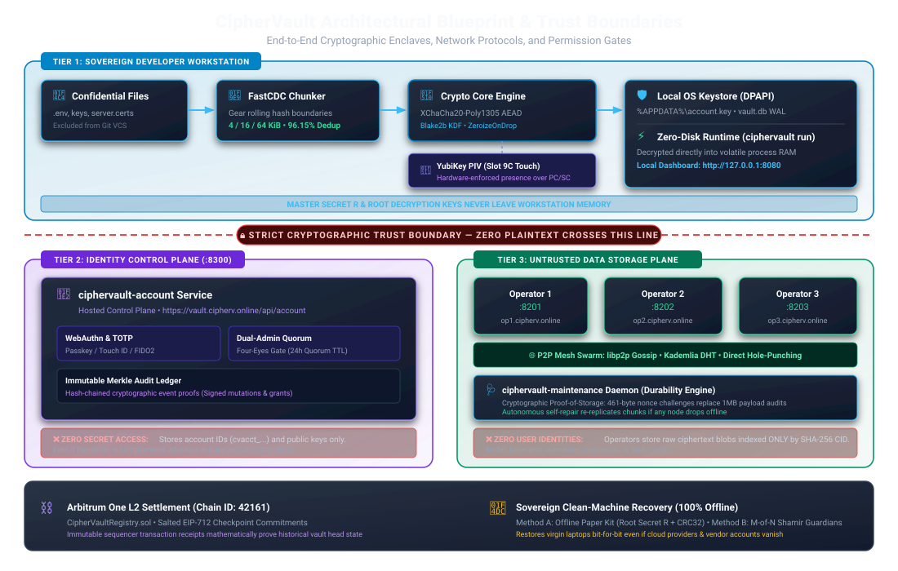
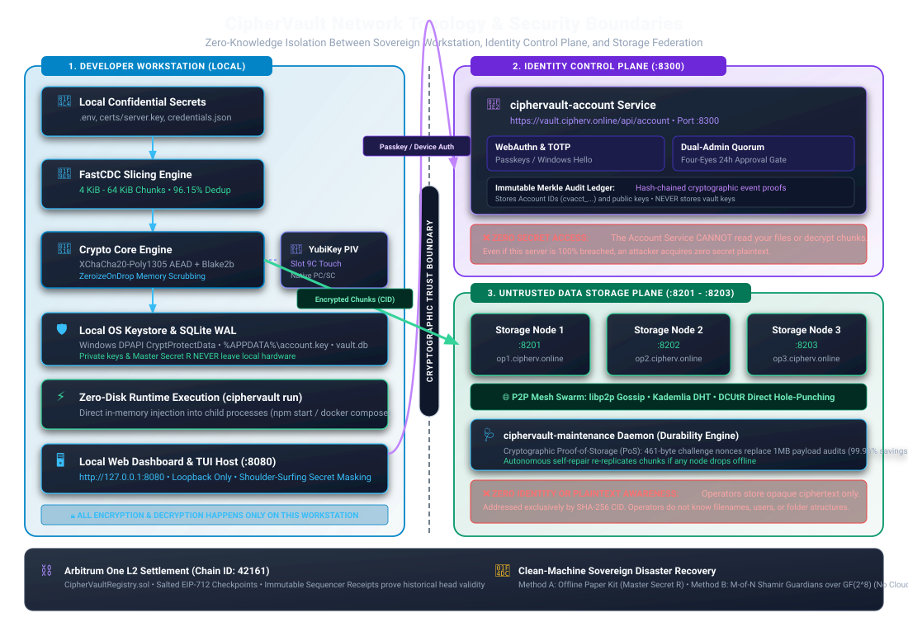
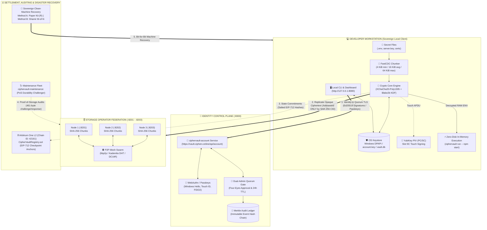
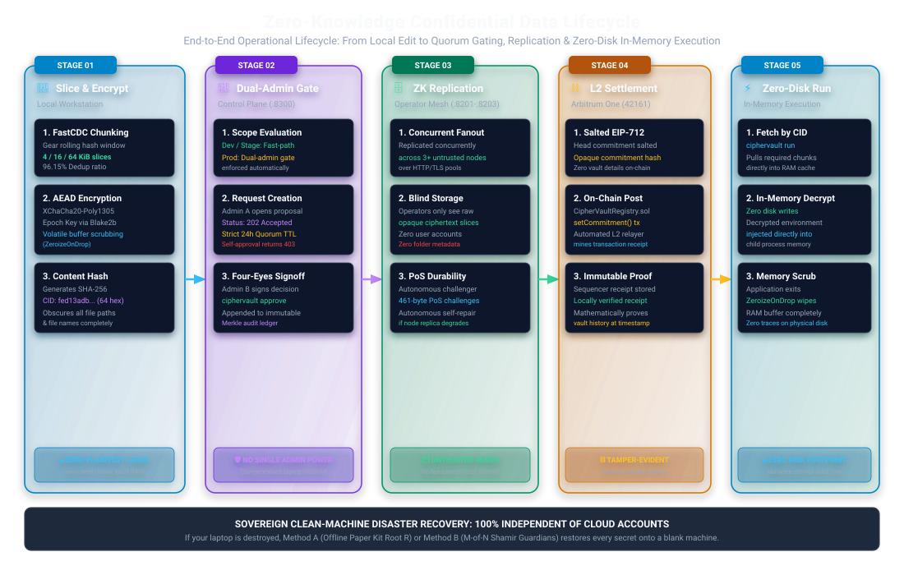
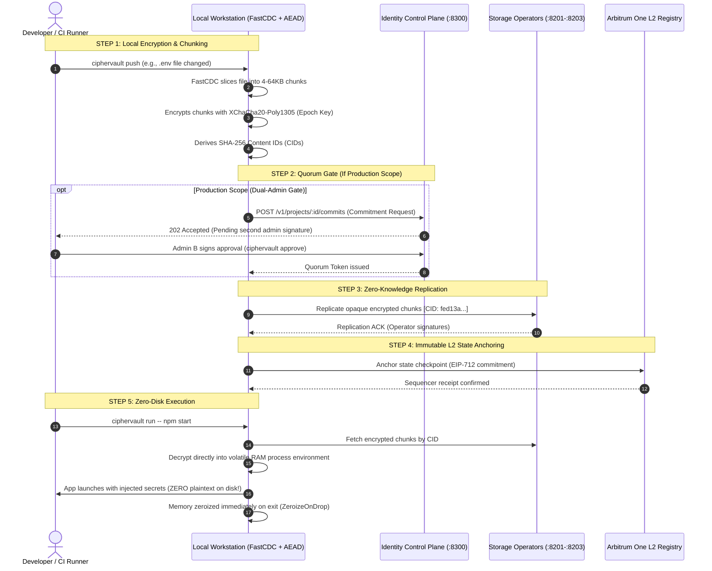

# 🌐 CipherVault Network Topology & Trust Boundaries

> **Architectural Specification & Security Isolation Model**  
> *Git tracks your source code. CipherVault protects everything Git leaves behind.*

## 🗺️ Architectural Blueprint & Trust Boundary Map

[](diagrams/09_architectural_blueprint.svg)

<details>
<summary><b>▶ Click to inspect raw text ASCII blueprint</b></summary>

```text
====================================================================================================
                        CIPHERVAULT ZERO-KNOWLEDGE NETWORK TOPOLOGY
====================================================================================================

 [ TIER 1: DEVELOPER WORKSTATION ] ── (Sovereign Local Client — Never Exports Plaintext Secrets)
 ┌────────────────────────────────────────────────────────────────────────────────────────────────┐
 │  Confidential Files (.env, certs, keys)                                                       │
 │       │                                                                                        │
 │       ▼                                                                                        │
 │  FastCDC Slicing Engine (4 KiB - 64 KiB Content-Defined Chunks, 96.15% Dedup)                  │
 │       │                                                                                        │
 │       ▼                                                                                        │
 │  Crypto Core Engine (XChaCha20-Poly1305 AEAD + Blake2b KDF) ◄──► YubiKey PIV (Slot 9C Touch)   │
 │       │                                                                                        │
 │       ├──► Local OS Keyring (Windows DPAPI / account.key / vault.db WAL)                       │
 │       └──► Zero-Disk In-Memory Execution (ciphervault run -- npm start)                        │
 └───────┬────────────────────────────────────────────────────────┬───────────────────────────────┘
         │                                                        │
         │ Identity & Quorum TLS                                  │ Opaque Ciphertext Blobs
         │ (Passkey / Ed25519 Signatures)                         │ (Addressed ONLY by SHA-256 CID)
         ▼                                                        ▼
 ══════════════════════════════════════ TRUST BOUNDARY ═══════════════════════════════════════════════
         │                                                        │
         ▼                                                        ▼
 [ TIER 2: IDENTITY CONTROL PLANE ]                      [ TIER 3: DATA STORAGE PLANE ]
 ciphervault-account (:8300)                             Federated Storage Operators (:8201 - :8203)
 ┌──────────────────────────────────────────────┐        ┌────────────────────────────────────────┐
 │ • User Accounts (cvacct_...) & Display Names │        │  Storage Node 1 (cv-operator-1 :8201)  │
 │ • Public Device Keys & WebAuthn Passkeys     │        │  Storage Node 2 (cv-operator-2 :8202)  │
 │ • Team Memberships & Role Grants (RBAC)      │        │  Storage Node 3 (cv-operator-3 :8203)  │
 │ • Dual-Admin Four-Eyes Gate (24h Quorum TTL) │        ├────────────────────────────────────────┤
 │ • Immutable Merkle Audit Ledger Chaining     │        │  P2P Mesh Swarm (libp2p / DHT / DCUtR) │
 ├──────────────────────────────────────────────┤        ├────────────────────────────────────────┤
 │ ❌ ZERO Plaintext Secrets or Master Keys     │        │ ❌ ZERO User Accounts or Usernames     │
 │ ❌ CANNOT Decrypt Any Vault Chunks           │        │ ❌ ZERO Plaintext or Filenames         │
 └──────────────────────────────────────────────┘        └───────────────────▲────────────────────┘
                                                                             │
                                                         Durability Audits   │ Proof-of-Storage (PoS)
                                                         (461-byte challenge)│ Nonce Responses
                                                                             │
                                                         ┌───────────────────┴────────────────────┐
                                                         │ [ TIER 4: MAINTENANCE FLEET ]          │
                                                         │ ciphervault-maintenance daemon         │
                                                         │ Automated Health Audits & Self-Repair  │
                                                         └────────────────────────────────────────┘

 ═════════════════════════════════════════════════════════════════════════════════════════════════════
 [ TIER 5: IMMUTABLE ANCHORING ]                         [ TIER 6: AIR-GAPPED RECOVERY ]
 Arbitrum One L2 Rollup (Chain ID: 42161)                Zero-Vendor Sovereign Clean-Machine Restore
 ┌──────────────────────────────────────────────┐        ┌────────────────────────────────────────┐
 │  CipherVaultRegistry.sol                     │        │  Method A: Offline Paper Kit (Root R)  │
 │  EIP-712 Checkpoint Commitment Receipts      │        │  Method B: M-of-N Shamir Guardians     │
 └──────────────────────────────────────────────┘        └────────────────────────────────────────┘
====================================================================================================
```

</details>

---

## 🏛 Visual Network Architecture & Topology

[](diagrams/08_network_topology.svg)

<details>
<summary><b>▶ Click to view raw Mermaid diagram definition (for live editors)</b></summary>



</details>

---

### 2. Zero-Knowledge Confidential Data Lifecycle (How Secrets Move)

[](diagrams/10_data_lifecycle_flow.svg)

<details>
<summary><b>▶ Click to view raw Mermaid sequence definition (for live editors)</b></summary>



</details>

---

## 🛡️ Trust Boundaries & Separation of Planes

CipherVault is engineered around mathematical isolation: no single compromised component or network compromise leaks your secrets.

| Plane | Network Components & Ports | What It Stores | Isolation & Zero-Knowledge Guarantee |
|---|---|---|---|
| **Client Workstation** | CLI (`ciphervault`), TUI, Embedded Web UI (`127.0.0.1:8080`) | Plaintext `.env`, Master Secret $R$, Device signing keys, OS Keyring (`DPAPI`) | **Complete sovereignty.** Master keys and decryption routines never leave local RAM. Zeroize buffers immediately scrub sensitive memory on exit. |
| **Identity Control Plane** | [`services/account`](file:///c:/Users/samue/OneDrive/Desktop/projects/CipherVault/services/account) (`:8300`) | Account IDs (`cvacct_...`), Public Keys, WebAuthn Passkeys, RBAC Roles | **No Secret Access.** Holds identities, device links, and quorum gates, but has **0% access** to vault encryption keys or file plaintexts. |
| **Data Storage Plane** | [`services/operator`](file:///c:/Users/samue/OneDrive/Desktop/projects/CipherVault/services/operator) (`:8201-8203`), P2P Swarm | Opaque encrypted ciphertext chunks indexed by SHA-256 Content IDs (CIDs) | **No User Accounts.** Operators know nothing about usernames, passwords, or folder trees. They only store anonymous ciphertext blobs. |
| **Maintenance & Fleet** | [`services/maintenance`](file:///c:/Users/samue/OneDrive/Desktop/projects/CipherVault/services/maintenance) daemon | Heartbeat logs, latency telemetry, Proof-of-Storage challenge receipts | Audits replica availability without ever downloading or decrypting full files. |
| **Settlement Layer** | Arbitrum One L2 (`Chain ID: 42161`), [`contracts/`](file:///c:/Users/samue/OneDrive/Desktop/projects/CipherVault/contracts) | Salted EIP-712 checkpoint hashes | Mathematically anchors snapshot head state on an immutable public ledger. |
| **Offline Recovery** | Paper Kit / Shamir Guardians | $M$-of-$N$ $\text{GF}(2^8)$ Polynomial Shares | **Air-gapped.** Restores machines cleanly even if all cloud accounts, services, and local disks are completely destroyed. |

---

## 🔑 Key Lifecycle & Data Flows

### 1. Write / Push Flow (`ciphervault push`)
```text
Plaintext Secret File (.env)
  │
  ▼ [FastCDC Engine]
Content-Defined Chunks (4 KiB - 64 KiB)
  │
  ▼ [Crypto Core Engine]
Encrypted with XChaCha20-Poly1305 (Derived from Epoch Key via Blake2b KDF)
  │
  ▼ [Hardware Presence]
Optional Touch on YubiKey Slot 9C (Ed25519)
  │
  ▼ [HTTP / TLS Pool]
Replicated concurrently to Storage Operators as opaque blobs:
  ├── Storage Node 1 (:8201) ── [CID: fed13a...]
  ├── Storage Node 2 (:8202) ── [CID: fed13a...]
  └── Storage Node 3 (:8203) ── [CID: fed13a...]
```

### 2. Runtime Decryption Flow (`ciphervault run -- npm start`)
```text
Storage Operators (Encrypted Chunks)
  │
  ▼ [HTTP Fetch by CID]
Workstation RAM (Volatile Memory)
  │
  ▼ [Decrypt with Local Keyring]
Decrypted Environment Variables
  │
  ▼ [Fork Child Process]
Injected directly into child process environment (Zero Plaintext on Disk!)
  │
  ▼ [Process Exit]
Memory wiped immediately via ZeroizeOnDrop compiler fences.
```

### 3. Dual-Admin Quorum Flow (`services/account/src/grants.rs`)
```text
Admin A (Alice)
  │
  ├── Requests: Escalate Bob to Admin (role=admin)
  ▼
Account Service (:8300)
  ├── Creates: grant_requests row (Status: Pending, TTL: 24 Hours)
  └── Returns: 202 Accepted (Not yet granted)
  │
Admin A attempts self-approval?
  └── ❌ Rejected with 403 Forbidden (GrantError::SelfApproval)
  │
Admin B (Charlie) reviews request:
  ├── Approves: POST /v1/projects/:pid/members/requests/:rid/decision
  ▼
Account Service (:8300)
  ├── Role applied to Bob
  └── Event appended to cryptographic Merkle Audit Ledger
```

---

## 📡 Network Port & Protocol Reference

| Service / Binary | Default Port | Protocol | Scope | Description |
|---|---|---|---|---|
| **Local Dashboard / Explorer** | `8080` | HTTP / SSE | Loopback (`127.0.0.1`) | Local visual secrets explorer and inspection server. |
| **Storage Operator 1** | `8201` | HTTP / REST | Public / Clustered | Federated zero-knowledge storage node. |
| **Storage Operator 2** | `8202` | HTTP / REST | Public / Clustered | Federated zero-knowledge storage node. |
| **Storage Operator 3** | `8203` | HTTP / REST | Public / Clustered | Federated zero-knowledge storage node. |
| **P2P Swarm Gossip** | `8211-8213` | libp2p / TCP / UDP | Cluster Mesh | Peer discovery, Kademlia DHT, and DCUtR hole-punching. |
| **Account Service** | `8300` | HTTP / TLS | Control Plane | Device enrollment, WebAuthn passkeys, and RBAC policies. |
| **Arbitrum L2 Relayer** | `8787` | HTTP / REST | Private / Local | Automated batch relayer for on-chain state commitments. |

---

## 🔗 Related Documentation & References

* [`docs/ACCOUNT_IDENTITY_DESIGN.md`](file:///c:/Users/samue/OneDrive/Desktop/projects/CipherVault/docs/ACCOUNT_IDENTITY_DESIGN.md) — Account vs. Vault Identity Architecture
* [`docs/CRYPTOGRAPHIC_AUDIT_SPECIFICATION.md`](file:///c:/Users/samue/OneDrive/Desktop/projects/CipherVault/docs/CRYPTOGRAPHIC_AUDIT_SPECIFICATION.md) — AEAD and KDF Mathematical Specifications
* [`docs/SETUP_GUIDE.md`](file:///c:/Users/samue/OneDrive/Desktop/projects/CipherVault/docs/SETUP_GUIDE.md) — Node Operator and Self-Hosting Guide
* [`services/account/src/grants.rs`](file:///c:/Users/samue/OneDrive/Desktop/projects/CipherVault/services/account/src/grants.rs) — Dual-Admin and Four-Eyes Implementation
* [`README.md`](file:///c:/Users/samue/OneDrive/Desktop/projects/CipherVault/README.md) — Main Project Readme and Benchmark Specifications
