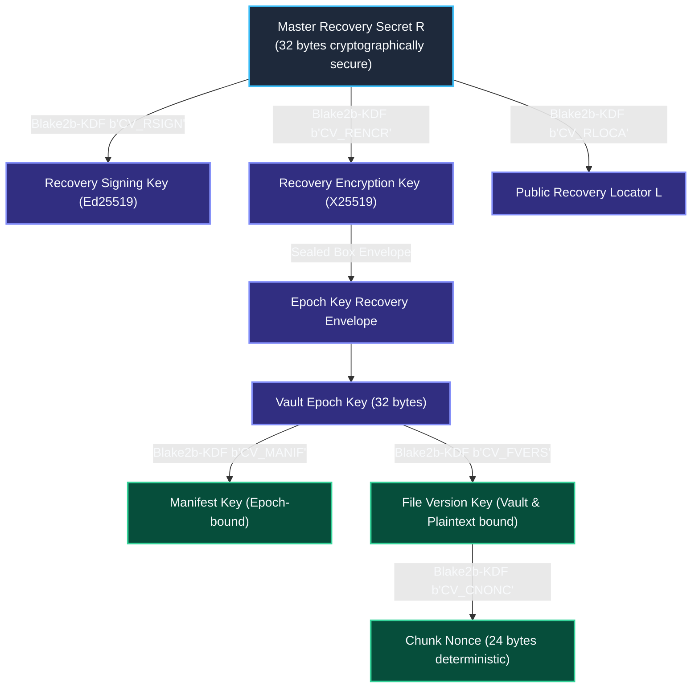

# CipherVault Cryptographic Audit Specification & Formal Verification Guide
**Target Audience**: External Cryptographic Auditors (Trail of Bits, Cure53, Kudelski Security), Security Architects, and Verification Engineers.

---

## 1. Executive Summary & Security Objectives

**CipherVault** provides client-encrypted secret backup and disaster recovery. This is an audit specification, not a completed external audit or formal proof. The cryptographic protocol is designed to provide:
1. **Confidentiality against Untrusted Operators**: Encrypted manifests hide paths and whole-file metadata; encrypted CBOR objects use SHA-256 CIDs. Deterministic equality, lengths, vault/epoch and access patterns remain observable. Default v1 exposes public candidate-file confirmation; opt-in v2 uses keyed opaque identifiers. Do not claim full IND-CCA2 security for deterministic deduplicated storage without a precise leakage model.
2. **Side-Channel Resistance & Constant-Time Arithmetic**: Galois Field $\text{GF}(2^8)$ multiplication (`gf_mul`) executes in strictly branchless, constant-time operations; the branchless claim is scoped to `gf_mul` only, not to the surrounding share-evaluation loops.
3. **Hardware-Anchored Device Identity**: Hardware-bound signing uses the configured PIV token key. Touch requirements depend on token provisioning and policy; simulation and subsystem tests do not establish a physical-presence ceremony. Validate the actual supported device/platform before asserting touch enforcement.
4. **Memory Hygiene and Injection**: Owned secret buffers use zeroizing containers in covered paths. Runtime secret injection uses process environments without writing a secrets file. This does not guarantee erasure of every copy or protection from swap/dumps/child behavior; restore intentionally publishes plaintext with restrictive permissions.

---

## 2. Cryptographic Primitives & Parameters

| Primitive | Standard / RFC | Parameterization / Key Size | Domain / Usage |
| :--- | :--- | :--- | :--- |
| **Symmetric AEAD** | draft-irtf-cfrg-xchacha | XChaCha20-Poly1305 (256-bit key, 192-bit/24-byte nonce, 128-bit MAC tag) | Chunk payload & manifest encryption |
| **Legacy Key Derivation** | CipherVault custom (not libsodium-compatible) | Blake2b-512 with `CipherVault-KDF-v1` prefix + 8-byte context + LE index, truncated to 32 bytes | Recovery descriptors, manifest keys, v1 file keys and nonces |
| **Opt-in v2 Chunk Derivation** | HKDF-SHA256 | Versioned salt; length-prefixed domain plus fixed-width vault/epoch/binding | Keyed opaque IDs, per-chunk key and nonce; independent review pending |
| **Content Addressing** | FIPS 180-4 | SHA-256 (32-byte digest) over canonical CBOR | Chunk Content Identifiers (CIDs) |
| **Digital Signatures** | RFC 8032 | Ed25519 (EdDSA over Curve25519) | Snapshot records, head commitments, device certs |
| **Key Agreement (ECDH)** | RFC 7748 | X25519 | Clean-machine sealed envelopes & recovery |
| **Threshold Secret Sharing** | Shamir (1979) | Galois Field $\text{GF}(2^8)$ with polynomial $0x11B$ | $M$-of-$N$ guardian disaster recovery |
| **Rolling Chunk Hash** | FastCDC (2016) | Gear Hash Matrix (SplitMix64) | Content-Defined Chunking |

---

## 3. Key Derivation Hierarchy & Domain Separation Registry

The diagram below describes the retained v1 hierarchy. Epoch and device keys are random; recovery envelopes carry sealed epoch keys. V2 chunk derivations are separately specified in [CHUNK_PROTOCOL_V2.md](../crates/snapshot/CHUNK_PROTOCOL_V2.md), including exact salt/info bytes, AEAD bindings and compatibility limits. Default captures remain v1 pending independent review; only `CIPHERVAULT_CHUNK_V2_WRITE=1` opts into v2. Readers support both versions without changing old addresses.



### Domain Separation Registry

| Context String | Primitives | Purpose |
| :--- | :--- | :--- |
| `b"CV_RSIGN"` (+ `CipherVault-KDF-v1` prefix) | Custom Blake2b-KDF | Derives Ed25519 recovery signing key from $R$ |
| `b"CV_RENCR"` (+ `CipherVault-KDF-v1` prefix) | Custom Blake2b-KDF | Derives X25519 recovery encryption key from $R$ |
| `b"CV_RLOCA"` (+ `CipherVault-KDF-v1` prefix) | Custom Blake2b-KDF | Derives public vault locator material |
| `b"CV_MANIF"` (+ `CipherVault-KDF-v1` prefix) | Custom Blake2b-KDF | Derives manifest encryption key from epoch key |
| `b"CV_FVERS"` (+ `CipherVault-KDF-v1` prefix) | Custom Blake2b-KDF | Derives deterministic file key bound to epoch + plaintext SHA-256 |
| `b"CV_CNONC"` (+ `CipherVault-KDF-v1` prefix) | Custom Blake2b-KDF | Derives deterministic 24-byte XChaCha20 nonce per chunk |
| `b"CIPHERVAULT-POS-V1"` | SHA-256 | Domain separator for Proof-of-Storage digests: `SHA-256("CIPHERVAULT-POS-V1" \|\| cid \|\| nonce \|\| data)` (`compute_pos_proof`) |
| `b"CipherVault-ApprovalChallenge-v1"`| Ed25519 (`sign_with_domain`, context `out_of_band_approval`) | Domain prefix inside out-of-band authorization signing bytes (no BLAKE2b step) |

---

## 4. Constant-Time Galois Field Arithmetic Proofs

In $M$-of-$N$ Shamir's Secret Sharing, secrets are elements of Galois Field $\text{GF}(2^8)$ defined by the irreducible Rijndael polynomial:
$$P(x) = x^8 + x^4 + x^3 + x + 1 \quad (0x11B)$$

### Branchless Multiplication
Classical shift-and-add algorithms branch on $(b \ \& \ 1)$ and high bit overflow $(a \ \& \ 0x80)$, creating microarchitectural timing and branch prediction side channels. CipherVault replaces all branches with bitwise mask operations:

```rust
#[inline(always)]
pub fn gf_mul(mut a: u8, mut b: u8) -> u8 {
    let mut p = 0u8;
    for _ in 0..8 {
        let mask_b = 0u8.wrapping_sub(b & 1); // 0xFF if LSB set, 0x00 otherwise
        p ^= a & mask_b;

        let mask_hi = 0u8.wrapping_sub((a >> 7) & 1); // 0xFF if MSB set, 0x00 otherwise
        a = (a << 1) ^ (0x1B & mask_hi);
        b >>= 1;
    }
    p
}
```

### Inversion via Fermat's Little Theorem
In $\text{GF}(2^8)$, any non-zero element $a$ satisfies:
$$a^{2^8 - 1} \equiv a^{255} \equiv 1 \implies a^{-1} \equiv a^{254}$$
$a^{254}$ is computed via a fixed-length square-and-multiply chain of 14 operations:
$$254 = 128 + 64 + 32 + 16 + 8 + 4 + 2$$
The exponentiation chain has fixed length and calls branchless `gf_mul`. Auditors should inspect generated code and surrounding secret-handling loops; source-level structure alone is not a platform-wide constant-time proof.

---

## 5. Formal Invariants Matrix for Audit Verification

| Invariant ID | Security Property | Formal Definition / Verification Check |
| :--- | :--- | :--- |
| **INV-01** | Protected Local Keys | Epoch/device key blobs use Windows DPAPI or a non-Windows AEAD envelope backed by an explicit master key/private key file. Metadata, tracked files, offline recovery exports and restore backups require separate disk protection. |
| **INV-02** | Master Secret Scrubbing | `RecoverySecret` implements `ZeroizeOnDrop`; volatile memory is scrubbed with compiler fences immediately after interactive init ceremony. |
| **INV-03** | Cross-Vault Isolation | FastCDC derivation incorporates `VaultEpochKey` and `vault_id`. Identical files across distinct vaults produce mutually uncorrelated ciphertexts. |
| **INV-04** | Hardware Signing | Hardware-bound commitments use the configured certified token signer. Physical presence and touch enforcement require independently checked token policy and a real device ceremony. |
| **INV-05** | Journaled Restores | Verify all decrypted files, stage private new files and backups in `.ciphervault-restore`, journal before per-file atomic publication, and roll back interrupted uncommitted work. External edits stop rollback with a retained journal; whole-tree visibility is not atomic. |
| **INV-06** | No Plaintext File During Runtime Injection | `ciphervault run` supplies secrets through child environment blocks without writing a secrets file. Child writes, OS inspection, swap and dumps are outside this guarantee. |
| **INV-07** | Configured Approval Quorum | Where an explicit approval policy applies, verify signed guardian receipts against that policy. Offline-root recovery material, threshold reconstruction, and account emergency codes are separate authorities; quorum approval is not a universal property of every recovery path. |

## 6. Required independent review

Review the legacy custom KDF and public candidate-confirmation boundary, opt-in deterministic HKDF v2 key/nonce construction and equality leakage, sealed-box key agreement and recipient binding, hardware/software authority composition, guardian-share consistency, authenticated DAG head/fork selection and freshness assumptions. Confirm unknown-version rejection and legacy fixture decoding; exercise repeated chunks, manifest reorder/tamper, cross-vault/epoch isolation, interrupted publication and external destination edits. Unit tests and implementation review do not close this external assurance gate. See [current guarantees](CURRENT_SECURITY_GUARANTEES.md) for deployment limits.
