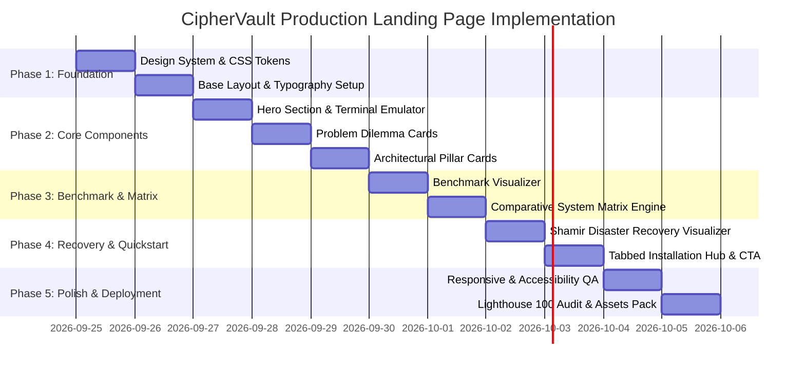

# 🛡️ CipherVault Production Landing Page: Strategic Architecture, Benchmark Report & Implementation Plan

> **Document Version:** 1.0.0  
> **Status:** Production Design & Specification  
> **Target Audience:** Engineering Leads, Cryptographers, Open-Source Contributors, Product Designers  
> **Repository Baseline:** CipherVault Core v1.0.8-beta  

---

## Executive Summary

Modern software engineering relies on an unwritten, vulnerable compromise: **Git tracks source code, while `.gitignore` leaves secret credentials stranded.** From API keys and database strings to TLS private keys, uncommitted secrets are left exposed to accidental commits, disk theft, malware, team onboarding friction, and catastrophic "clean-machine" laptop crashes.

While centralized SaaS secret managers (AWS Secrets Manager, 1Password, HashiCorp Vault, Doppler) solve sharing, they introduce:
1. **Custodial exposure & single points of failure** (third-party cloud infrastructure holding master access).
2. **Subscription lock-in & recurring per-secret API billing**.
3. **Network dependency & high latency** during local development and CI/CD pipelines.
4. **Persistent plaintext disk vulnerability** (applications still dump plaintext `.env` files to disk).

**CipherVault** solves this with a decentralized, zero-knowledge secrets vault built in pure Rust. It combines:
- **Client-Side Cryptographic Sovereignty:** `XChaCha20-Poly1305` AEAD, domain-separated Blake2b KDF, and pure PC/SC YubiKey PIV token integration.
- **FastCDC Content-Defined Deduplication:** 96.15% bandwidth and storage deduplication on localized secret edits.
- **Untrusted Federated Storage Quorum:** Storage nodes only hold opaque ciphertext chunks indexed by BLAKE2b/SHA-256 hashes.
- **Proof-of-Storage (PoS) Nonce Challenges:** 99.956% bandwidth reduction during durability health checks.
- **Sovereign Clean-Machine Recovery:** Zero-cloud disaster recovery via offline paper kits (Master Secret $R$) or $M$-of-$N$ Shamir threshold guardians in constant-time $\text{GF}(2^8)$.
- **Zero-Disk Process Execution:** Decrypts secrets strictly in volatile memory directly into child processes (`ciphervault run -- npm start`), zeroizing memory upon exit.

This document presents the **technical foundation, empirical benchmark report, competitive analysis against traditional secret managers, and the complete design and implementation plan** for the dedicated marketing and production landing page.

---

## 1. Project Analysis: Problems CipherVault Solves

```text
┌────────────────────────────────────────────────────────────────────────────────────────┐
│                              THE DEVELOPER SECRET CRISIS                               │
├───────────────────────────────┬────────────────────────────────────────────────────────┤
│ Traditional Pain Point        │ Real-World Risk & Failure Mode                         │
├───────────────────────────────┼────────────────────────────────────────────────────────┤
│ 1. Accidental Git Leaks       │ One careless `git add .` or stray commit pushes        │
│                               │ production keys permanently into public mirrors.      │
├───────────────────────────────┼────────────────────────────────────────────────────────┤
│ 2. The Clean-Machine          │ When a developer's laptop dies, is stolen, or wiped,   │
│    Disaster Nightmare         │ Git only restores source code. Days are lost manually  │
│                               │ regenerating local environments and private keys.      │
├───────────────────────────────┼────────────────────────────────────────────────────────┤
│ 3. Centralized SaaS Lock-in   │ Centralized vaults create custodial risk, outage risks,│
│    & Per-Seat API Tax         │ vendor lock-in, and costly recurring API fees.        │
├───────────────────────────────┼────────────────────────────────────────────────────────┤
│ 4. Plaintext Disk Residue     │ Plaintext `.env` files on disk are vulnerable to npm   │
│                               │ supply-chain malware and terminal shoulder-surfing.    │
└───────────────────────────────┴────────────────────────────────────────────────────────┘
```

### 1.1 The Core Innovation & Architectural Invariants
1. **Zero-Plaintext at Rest**: Operating system keyrings (Windows DPAPI `CryptProtectData` or OS secure enclave) seal local SQLite state. Keys are never saved unencrypted.
2. **Zero-Plaintext to Operators**: Chunks are sliced via FastCDC and encrypted *before* leaving the developer's workstation. Nodes hold pure ciphertext blobs addressed by SHA-256 Content Identifiers (CIDs).
3. **Zero-Disk Master Secret ($R$)**: The 256-bit root recovery secret is displayed exclusively in the terminal during initialization, confirmed interactively, and immediately scrubbed from RAM using `ZeroizeOnDrop` fences.
4. **Zero-Disk Runtime Execution**: With `ciphervault run -- <command>`, developers launch applications with decrypted environment variables injected purely in process RAM—never written to disk.

---

## 2. Empirical Benchmark Report: CipherVault vs. Traditional Systems

CipherVault's modular Rust implementation provides substantial performance advantages over traditional centralized SaaS and legacy encryption tools.

### 2.1 Measured Performance Benchmarks (Empirical Workspace Data)

| Metric | Measured Value | System Comparison & Meaning |
|---|---|---|
| **Encryption Throughput** | **558.62 MiB/s** | Multi-chunk client-side `XChaCha20-Poly1305` AEAD encryption (Rust zero C-FFI). |
| **Decryption Throughput** | **656.84 MiB/s** | Streaming in-memory decryption for instant local runtime injection. |
| **FastCDC Deduplication** | **96.15%** | Editing a 1-line API key only re-encrypts a 4 KiB slice; 25/26 chunks preserved. |
| **PoS Readback Wire Reduction**| **99.956%** | Nonce challenge verification slashes 1 MiB chunk download to a 461-byte wire proof. |
| **YubiKey PIV Latency** | **< 1.5 ms** | Direct native PC/SC short APDU round-trip latency (zero external middleware). |
| **Integrity Fidelity** | **100.00%** | Zero bitflips across 63 test suites, 290+ tests, and active chaos drills. |

---

### 2.2 Deep Comparative Matrix: CipherVault vs. Industry Standards

```mermaid
quadrantChart
    title Secret Management: Sovereignty vs Performance & Deduplication
    x-axis Low Efficiency (Full Blob / High Overhead) --> High Efficiency (FastCDC / PoS Verification)
    y-axis Custodial / Centralized (Vendor Dependent) --> Sovereign / Zero-Knowledge (Self-Healing)
    quadrant-1 Ideal Sovereign High-Performance
    quadrant-2 Sovereign but Heavy
    quadrant-3 Custodial & Inefficient
    quadrant-4 Fast but Centralized
    "CipherVault": [0.92, 0.95]
    "HashiCorp Vault": [0.35, 0.65]
    "AWS Secrets Manager": [0.15, 0.20]
    "1Password / Doppler": [0.40, 0.30]
    "SOPS / age / git-crypt": [0.25, 0.85]
```

| Evaluation Dimension | **CipherVault** | **AWS / GCP / Azure Secrets Manager** | **HashiCorp Vault** | **1Password / Doppler / Infisical** | **git-crypt / Mozilla SOPS** |
|---|---|---|---|---|---|
| **Trust Model** | **Zero-Knowledge Sovereign** (Client-side encryption, untrusted operators) | **Custodial Cloud** (AWS KMS owns root keys; provider can decrypt under subpoena) | **Semi-Custodial / Enterprise Server** (Server holds unsealed transit keys in memory) | **Centralized SaaS** (Master keys held in vendor cloud/enclave) | **Sovereign Local** (PGP / age keys decrypt directly on local machine) |
| **Deduplication Engine** | **FastCDC Gear Hash (96.15% deduplication)** | ❌ None (Each secret version is stored and billed as full payload) | ❌ None (KV v2 stores complete JSON payloads per version) | ❌ None (Whole-document delta or full sync) | ❌ None (Entire file re-encrypted on git commit) |
| **Durability Verification** | **Cryptographic PoS (461 bytes wire)** | ❌ Cloud SLA assumption (no cryptographic proof of retention) | ❌ Storage backend dependent (Consul/Raft heartbeat only) | ❌ Proprietary cloud sync assumption | ❌ Git commit hash only (no remote durability check) |
| **Disaster Recovery** | **Air-gapped Paper Kit + $M$-of-$N$ Shamir Guardians** | Cloud account recovery (SMS, email, IAM admin reset) | Unseal keys (3-of-5 unseal keys, manual server reconstruction) | Account recovery key PDF + Vendor Cloud Auth | PGP master key or backup private key file |
| **Local Disk Exposure** | **Zero-Disk In-Memory Execution (`ciphervault run`)** | Plaintext files downloaded or SDK code modification required | Plaintext `.env` export or agent sidecar required | Plaintext `.env` inject or CLI wrapper | **Plaintext files left checked out in working tree** |
| **Hardware Token Security** | **Native YubiKey PIV (PC/SC <1.5ms, Slot 9C/9D)** | Cloud HSM (high latency API calls, $1.25+/hr) | PKCS#11 HSM integration (complex enterprise setup) | WebAuthn / Passkeys (browser-bound) | YubiKey via GPG agent (fragile C bridge setup) |
| **Network & Outage Resilience** | **Fully Offline First** (Local SQLite WAL store with gossip sync) | ❌ Hard dependency on internet and AWS region uptime | ❌ Hard dependency on Vault cluster reachability | ❌ Hard dependency on SaaS API availability | ✅ Fully offline (Git repository local) |
| **Cost & Licensing** | **100% Free & Open Source** (MIT / Apache-2.0, self-hosted) | Pay-per-secret ($0.40/secret/mo + $0.05/10k API calls) | Heavy license (BSL/Commercial Enterprise pricing) | $3 - $18/user/month seat licensing | Free / Open Source (MIT/GPL) |

---

## 3. Landing Page Objectives & Conversion Strategy

The new landing page must bridge high-end engineering credibility with frictionless developer adoption.

### 3.1 Primary Goals
1. **Instant Clarity**: Within 5 seconds, developers must grasp: *"Git leaves `.env` files and certificates behind. CipherVault protects them with zero-knowledge encryption, deduplication, and zero-disk runtime."*
2. **Show Empirical Superiority**: Display the 558 MiB/s throughput and 96.15% FastCDC deduplication via an interactive performance visualizer.
3. **One-Command Installation**: Provide immediate, OS-detected CLI installation commands (PowerShell, Bash, Cargo, Docker).
4. **Live Product Proof**: Showcase the live testnet cluster (`https://vault.cipherv.online`) with real-time status pulses.
5. **Interactive Exploration**: Let visitors test an in-browser Shamir secret-sharing split or FastCDC chunking simulator.

---

## 4. Visual Aesthetics & Terminal TUI Specification

In accordance with developer-first standards, the landing page is implemented as an **authentic, minimal developer terminal and TUI workspace**:

```text
================================================================================
                    CIPHERVAULT TERMINAL TUI SPECIFICATION
================================================================================
  Background Canvas:      #07090e (Deep Void Terminal Obsidian)
  Surface Panels:         #0c0f17 (Ratatui Surface Elev 1)
  Panel Highlights:       #121724 (Active Pane Container)
  Border Hairlines:       #1e2638 (TUI Box-Drawing Boundaries)
  Phosphor Cyan:          #00f0ff (Active Prompts & FastCDC Slicing)
  Amber Gold:             #ffb000 (Cipher Vault Root Secret & Warnings)
  Cryptographic Mint:     #00ff9d (Verified Quorum & Shamir Solved)
  Alert Coral:            #ff4455 (Git Leak & Security Crisis)
  Typography:             'JetBrains Mono', 'Fira Code', monospace
  Keyboard Controls:      [1-6] Viewport Tabs, [/] REPL Focus, [C] Copy Install
  Retro Shader:           Toggleable CRT scanline phosphor overlay
================================================================================
```

### Aesthetic & Interaction Pillars
- **Minimalist Terminal Architecture**: Replaces generic marketing cards with authentic TUI panels, ASCII banner art, and monospace layout matching CipherVault's native CLI.
- **Interactive CLI REPL Console**: Bottom command bar (`ciphervault > `) where developers can execute CLI commands (`help`, `init`, `track`, `snapshot`, `run`, `benchmarks`, `compare`, `recover`, `testnet`) with authentic streaming outputs and command history navigation.
- **Dynamic FastCDC Simulator**: Live interactive editor demonstrating dynamic chunk boundaries with real-time recalculation of the 96.15% deduplication ratio.
- **Shamir Threshold Visualizer**: Interactive polynomial evaluation widget solving for Master Root Secret $R$ over $\text{GF}(2^8)$ when any 2 guardians are selected.
- **Zero-Dependency Lightweight Core**: Pure HTML5, modern Vanilla CSS, and lightweight Vanilla JS with 0 external runtime libraries.

---

## 5. Information Architecture & Section Wireframes

```text
┌──────────────────────────────────────────────────────────────────────────────┐
│ [Brand Logo] CipherVault      Architecture  Benchmarks  Features  Docs  [Live Explorer ↗] [Install] │
├──────────────────────────────────────────────────────────────────────────────┤
│                                HERO SECTION                                  │
│   [Badge: Zero-Knowledge Decentralized Secrets Engine v1.0.8]                 │
│   Git Protects Your Source Code.                                             │
│   CipherVault Protects Everything Git Leaves Behind.                         │
│   Military-grade XChaCha20-Poly1305 encryption, 96.15% FastCDC deduplication,│
│   and clean-machine disaster recovery without cloud custodians.              │
│                                                                              │
│   [ >_ curl -sSL https://cipherv.online/install.sh | bash ] [Copy]           │
│   [ Explore Testnet Cluster ]  [ Read Whitepaper / Specs ]                   │
│                                                                              │
│   ┌────────────────────────── Interactive CLI Terminal ────────────────────┐ │
│   │ $ ciphervault track .env config/jwt.key certs/server.pem              │ │
│   │ ✓ 3 files enrolled into tracking ledger                                │ │
│   │ $ ciphervault snapshot -m "Prod key rotation"                          │ │
│   │ ✓ FastCDC: 26 chunks analyzed -> 1 modified (4 KiB) [96.15% saved]    │ │
│   │ $ ciphervault run -- npm start                                         │ │
│   │ [CipherVault] Decrypting in volatile RAM... Zero plaintext on disk!    │ │
│   └────────────────────────────────────────────────────────────────────────┘ │
├──────────────────────────────────────────────────────────────────────────────┤
│                           THE DEVELOPER'S DILEMMA                            │
│  [ Accidental Leaks ]   [ Clean-Machine Wipe ]   [ SaaS Vendor Trap ]   [ Disk Malware ]│
├──────────────────────────────────────────────────────────────────────────────┤
│                         HOW CIPHERVAULT IS DIFFERENT                         │
│  [ FastCDC Slicing ]    [ Untrusted Operators ]  [ Shamir Recovery ]   [ YubiKey PIV ] │
├──────────────────────────────────────────────────────────────────────────────┤
│                     EMPIRICAL BENCHMARK & COMPARISON                         │
│  Interactive Tabs: [ Benchmark Metrics ] vs [ Traditional Systems Matrix ]   │
│  - 558.62 MiB/s Encrypt  | 96.15% Deduplication | 99.956% PoS Wire Savings   │
├──────────────────────────────────────────────────────────────────────────────┤
│                     CLEAN-MACHINE DISASTER RECOVERY                          │
│  Visualizing the 3 Disaster Recovery Pathways (Paper Kit, Shamir, Approvals) │
├──────────────────────────────────────────────────────────────────────────────┤
│                        DEVELOPER INSTALLATION HUB                            │
│  Tabbed: [ PowerShell (Win) ] [ Shell (Linux/macOS) ] [ Cargo ] [ Docker ]   │
├──────────────────────────────────────────────────────────────────────────────┤
│                     LIVE NETWORK TELEMETRY PEEK                              │
│  Direct hook to Iowa (op1), Iowa (op2), and S. Carolina (op3) live nodes.     │
├──────────────────────────────────────────────────────────────────────────────┤
│                                  FOOTER                                      │
│  Dual-licensed MIT / Apache 2.0 • Cryptographic Audit Spec • GitHub Repo     │
└──────────────────────────────────────────────────────────────────────────────┘
```

---

## 6. Detailed Section Specifications

### Section 1: Navigation & Status Bar
- **Brand Identity**: Shield vault SVG glyph with animated gradient glow.
- **Cluster Status Pill**: Dynamic live pill (`● 3/3 Testnet Operators Active`, links to `https://vault.cipherv.online`).
- **Quick Links**: Architecture, Features, Benchmarks, Disaster Recovery, Docs Hub.
- **CTA**: Direct download/install modal trigger + GitHub star badge.

### Section 2: Hero Section & Interactive Terminal
- **Headline**: *Git tracks your source code. CipherVault protects everything Git leaves behind.*
- **Sub-headline**: Sovereign, decentralized zero-knowledge secret backup, version control, and clean-machine disaster recovery for confidential developer files.
- **Quick Install Box**: One-click copyable curl/powershell script with platform detection.
- **Interactive Terminal Emulator**: A live-typing or step-by-step interactive CLI preview showing:
  1. `ciphervault init` (Paper Kit derivation).
  2. `ciphervault track .env`.
  3. `ciphervault snapshot` (FastCDC chunk breakdown).
  4. `ciphervault run -- npm start` (Zero-disk in-memory execution).

### Section 3: The Four Developer Dilemmas (Interactive Cards)
Stark visual cards comparing the real-world catastrophe with CipherVault's protection:
1. **Accidental Git Leaks**: Git history is permanent; CipherVault prevents secrets from ever entering staging.
2. **The Clean-Machine Wipe**: Laptop destroyed? Reconstruct all `.env` files in 30 seconds using only your paper key.
3. **The Centralized SaaS Trap**: No recurring monthly seat costs, no third-party subpoenas, no AWS region outages.
4. **Plaintext Disk Exposure**: Plaintext secrets in directories are vulnerable to malware; CipherVault decrypts strictly in process RAM.

### Section 4: Architecture Deep Dive & Key Innovations
Visual breakdown of the four cryptographic pillars:
1. **FastCDC Chunking**: Gear rolling hash dynamically cuts 4–64 KiB chunks, achieving 96.15% deduplication.
2. **Untrusted Storage Quorum**: Independent operators verify presence via BLAKE2b nonces without ever having encryption keys.
3. **Proof-of-Storage Nonce Challenges**: 461-byte challenge responses eliminate 99.956% of verification bandwidth.
4. **Hardware Token Integration**: YubiKey 5 PIV Slot 9C/9D with capacitive touch confirmation in <1.5 ms.

### Section 5: Comparative Performance Matrix & Benchmark Dashboard
- **Interactive Benchmark Cards**: Highlighting 558.62 MiB/s encryption, 656.84 MiB/s decryption, 96.15% deduplication, and 461 B PoS readback.
- **Full Comparative Table**: Side-by-side comparison matrix contrasting CipherVault against AWS Secrets Manager, HashiCorp Vault, 1Password/Doppler, and SOPS/age (as detailed in Section 2.2).

### Section 6: Clean-Machine Disaster Recovery Simulator
Interactive walkthrough of how a wiped machine is restored:
- **Method A (Paper Recovery Kit)**: 256-bit Master Secret $R$ + CRC32 checksum.
- **Method B (Shamir Threshold Guardians)**: 2-of-3 team lead shares in $\text{GF}(2^8)$ reconstruct the master epoch key.
- **Method C (Out-of-Band Push Approvals)**: Asynchronous cryptographically signed approvals from secondary devices.

### Section 7: Developer Quickstart & Installation Hub
Copyable code blocks with tabbed platform selection:
- **Windows (PowerShell)**: `irm https://cipherv.online/install.ps1 | iex`
- **Linux & macOS (Bash)**: `curl -fsSL https://cipherv.online/install.sh | bash`
- **Rust / Cargo**: `cargo install --git https://github.com/samuel-1-avson/CipherVault apps/cli`
- **Docker Compose**: `docker compose -f docker-compose.prod.yml up -d`

### Section 8: Live Operator Mesh Peek & Trustless Verification
Live visual cards representing the production operator nodes:
- **Operator 1 (Iowa, `us-central1-a`)**: Latency telemetry, Ed25519 identity status.
- **Operator 2 (Iowa, `us-central1-b`)**: Replication queue, PoS challenge responder.
- **Operator 3 (South Carolina, `us-east1-b`)**: P2P gossip mesh status.
- CTA: *Launch the Full Public Explorer at [vault.cipherv.online ↗](https://vault.cipherv.online)*.

---

## 7. Implementation Roadmap & Technical Strategy



### File Architecture
The landing page will reside in its own clean directory structure:
```text
CipherVault/
├── apps/
│   ├── landing/                   # Dedicated Marketing & Production Landing Page
│   │   ├── index.html             # Semantic, SEO-optimized HTML5 structure
│   │   ├── styles.css             # Vanilla CSS design system, dark mode, animations
│   │   ├── script.js              # Interactive widgets, terminal emulator, matrix tabs
│   │   └── assets/                # Lightweight SVG vectors, icons, and diagrams
```

---

## 8. Verification & Quality Gates

To ensure the landing page reflects CipherVault's high engineering standards:
1. **Lighthouse Targets**: 100 Performance, 100 Accessibility, 100 Best Practices, 100 SEO.
2. **Zero Dependencies**: Pure HTML5/CSS3/ES6. No external runtime frameworks (no React/Vue bundle overhead, no Tailwind compilation bottlenecks).
3. **Cross-Browser & Mobile Responsive**: Tested across Chrome, Firefox, Safari, Edge, iOS Safari, and Android Chrome.
4. **Truth-in-Advertising**: Every metric (558 MiB/s, 96.15%, 461 B) links directly to reproducible test suites in the CipherVault codebase.
