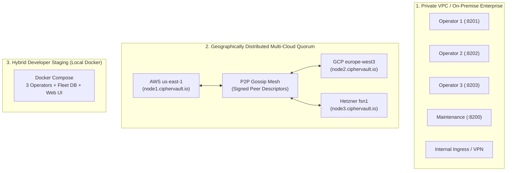

# CipherVault: Enterprise Production Deployment & Operations Guide

This guide provides the complete operational runbook for deploying, securing, scaling, and managing CipherVault storage operator clusters, autonomous maintenance daemons, and client toolchains in production environments.

---

## 1. Deployment Topologies

CipherVault supports three primary deployment architectures:



1. **Private VPC / Corporate Staging**: All 3 operator nodes run within an isolated cloud VPC or internal datacenter behind a private Caddy/Nginx reverse proxy or Tailscale/WireGuard mesh.
2. **Geographically Distributed Multi-Cloud Quorum**: Three independent operators deployed across distinct cloud providers (e.g. AWS, GCP, Hetzner), communicating via signed P2P gossip announcements over public HTTPS.
3. **Hybrid Developer Staging**: Fully containerized local cluster for staging validation using `docker compose -f deploy/docker-compose.prod.yml up -d`.

---

## 2. Hardware & Infrastructure Sizing

| Component | Minimum Spec (Staging) | Recommended Spec (Production 10k+ Vaults) | Storage Requirement |
|---|---|---|---|
| **Storage Operator (per node)** | 1 vCPU, 1 GB RAM | 2–4 vCPU, 4–8 GB RAM | NVMe SSD (ext4/XFS) sized to $1.5\times$ target replica volume |
| **Maintenance Fleet Daemon** | 1 vCPU, 512 MB RAM | 2 vCPU, 2 GB RAM | 10 GB SSD for SQLite WAL audit history |
| **Caddy Ingress Proxy** | 1 vCPU, 512 MB RAM | 2 vCPU, 2 GB RAM | Minimal (<1 GB for TLS cert cache) |
| **Client Workstation / CI Runner**| 1 vCPU, 256 MB RAM | 2 vCPU, 1 GB RAM | Standard workspace storage |

---

## 3. Production Deployment with Docker Compose & Caddy

### Step 1: Clone Repository & Prepare Environment
```bash
git clone https://github.com/samuel-1-avson/CipherVault.git /opt/ciphervault
cd /opt/ciphervault
```

### Step 2: Configure Production Environment Variables
Create `/opt/ciphervault/.env`:
```ini
# ACME Email for Let's Encrypt TLS Certificate Issuance
ACME_EMAIL=security@yourdomain.com

# TLS Mode: 'internal' (self-signed/local) or 'acme' (public domain certificates)
TLS_MODE=acme

# Public Domain Names for Storage Operator Ingress
OPERATOR_DOMAIN_1=node1.ciphervault.yourdomain.com
OPERATOR_DOMAIN_2=node2.ciphervault.yourdomain.com
OPERATOR_DOMAIN_3=node3.ciphervault.yourdomain.com
DASHBOARD_DOMAIN=dashboard.ciphervault.yourdomain.com
```

### Step 3: Launch Production Cluster
```bash
docker compose -f deploy/docker-compose.prod.yml up -d
```

### Step 4: Verify Service Health
```bash
docker compose -f deploy/docker-compose.prod.yml ps
```
All containers (`ciphervault-ingress`, `ciphervault-operator-1`, `ciphervault-operator-2`, `ciphervault-operator-3`, `ciphervault-maintenance`, `ciphervault-dashboard`) should report `healthy` or `running`.

---

## 4. Ingress Hardening, Rate Limiting & Firewall Rules

### Recommended Caddy Configuration (`deploy/caddy/Caddyfile`)
The included Caddy ingress provides:
1. **Automatic HTTPS**: Zero-touch TLS certificate lifecycle management via Let's Encrypt / ZeroSSL.
2. **Payload Size Guard**: Restricts maximum HTTP request bodies to 5 MiB (`max_size 5MB`), preventing payload buffer exhaustion.
3. **Security Headers**: Enforces HSTS (`max-age=31536000`), `X-Content-Type-Options: nosniff`, and frame sandboxing.
4. **Upstream Connection Keepalives**: Reuses HTTP connections to avoid TCP handshakes between proxy and operators.

### Cloudflare / WAF Rate Limiting Policy
If using Cloudflare or an edge reverse proxy in front of the operators:
- **Challenge Endpoint (`POST /v1/challenges`)**: Rate limit to 30 requests/minute per IP.
- **Object Upload (`PUT /v1/objects/:cid`)**: Rate limit to 120 requests/minute per authenticated session.
- **P2P Gossip (`POST /v1/peers/announce`)**: Rate limit to 10 requests/minute per IP.
- **Out-of-Band Auth (`POST /v1/auth/challenges`)**: Rate limit to 10 requests/minute per IP.

---

## 5. Client Toolchain Installation Across Operating Systems

### Method A: One-Line Install Script
- **Linux & macOS**:
  ```bash
  curl -fsSL https://raw.githubusercontent.com/samuel-1-avson/CipherVault/main/dist/scripts/install.sh | bash
  ```
- **Windows (PowerShell as User)**:
  ```powershell
  irm https://raw.githubusercontent.com/samuel-1-avson/CipherVault/main/dist/scripts/install.ps1 | iex
  ```

### Method B: Package Managers
- **macOS / Linux (Homebrew)**:
  ```bash
  brew tap samuel-1-avson/ciphervault
  brew install ciphervault
  ```
- **Windows (Scoop)**:
  ```powershell
  scoop bucket add ciphervault https://github.com/samuel-1-avson/CipherVault
  scoop install ciphervault
  ```
- **Windows (Winget)**:
  ```powershell
  winget install CipherVault.CipherVault
  ```

### Method C: Cargo Binstall / From Source
```bash
cargo install --git https://github.com/samuel-1-avson/CipherVault.git ciphervault-cli
```

---

## 6. Arbitrum One L2 Settlement Anchoring

CipherVault commits vault head states to Arbitrum One for immutable sequencing and tamper-evident audit trails.

### Testnet Pre-Flight (Arbitrum Sepolia)
```bash
node scripts/deploy-registry.cjs --network arbitrum_sepolia
```

### Mainnet Deployment (Arbitrum One — ChainID 42161)
1. Ensure the deployer account has ETH on Arbitrum One for gas (~0.0005 ETH).
2. Execute deployment:
   ```bash
   export PRIVATE_KEY="0x..."
   export ARBITRUM_ONE_RPC="https://arb1.arbitrum.io/rpc"
   node scripts/deploy-registry.cjs --network arbitrum_one
   ```
3. Record the deployed contract address in the cluster's client configuration or pass via `--registry-address 0x...`.

---

## 7. Monitoring, Auditing & Fleet Health

### 1. Querying Cluster Durability
The `ciphervault-maintenance` daemon continually probes replica health. To inspect fleet health:
```bash
# Via CLI:
ciphervault audit

# Via Maintenance Daemon API:
curl http://localhost:8200/api/fleet/status
```

### 2. Autonomous Replica Self-Repair
If an operator disk fails or a node goes offline:
```bash
ciphervault repair --auto-replicate
```
The maintenance scheduler automatically detects degraded chunks (replica count $< 3$) and replicates them from surviving healthy operators to re-establish quorum.

### 3. Dynamic P2P Gossip Status
Inspect discovered peer operators across the cluster:
```bash
ciphervault peers --discover
```

---

## 8. Disaster Recovery & Emergency Operations

### Scenario: Total Local Workstation Loss (Clean Replacement Machine)
1. User provides offline paper recovery kit:
   ```bash
   ciphervault recover --kit emergency_recovery_kit.txt --to ./recovered_secrets/
   ```
2. Or reconstructs master secret $R$ via $M$-of-$N$ threshold guardian sheets:
   ```bash
   ciphervault recover --shares guardian_1.txt guardian_2.txt --to ./recovered_secrets/
   ```
3. If out-of-band push approval is enforced:
   ```bash
   ciphervault recover --kit emergency_recovery_kit.txt --to ./recovered_secrets/ --require-approval
   ```
   An authorized team lead approves via:
   ```bash
   ciphervault approve sign <CHALLENGE_ID>
   ```

---

## 9. Pre-Launch Verification Checklist

- [ ] All 3 storage operators return HTTP 200 with unique signing public keys on `/v1/info`.
- [ ] Reverse proxy terminates valid TLS certificates with zero browser/client warnings.
- [ ] FastCDC deduplication and Proof-of-Storage challenge readback verified.
- [ ] Maintenance daemon writes audit history into SQLite WAL (`fleet.db`).
- [ ] Emergency offline clean-machine recovery tested in staging.
- [ ] GitHub Actions release workflow successfully builds and attaches cross-platform artifacts.
