# CipherVault: Comprehensive System Architecture & Operational Workflows

**Version:** `v1.0.0`  
**Classification:** Technical Architecture & Workflow Specification  
**Status:** Hardened Production Ready  

---

## 1. Executive System Overview

**CipherVault** is a zero-knowledge, developer-first secret backup and disaster recovery platform engineered in Rust and Solidity. It guarantees that confidential application configurations (e.g. `.env`, TLS private keys, database credentials, API tokens) can be reliably recovered on a clean replacement machine using only an offline paper recovery kit or distributed threshold guardian shares, without trusting or relying upon centralized coordinators, SaaS databases, or blockchain wallets.

### Fundamental Security Axioms
1. **Zero Plaintext at Rest**: Local database secrets (device signing keys, active epoch encryption keys) are protected using OS-native credential storage (Windows DPAPI or machine-entropy AEAD).
2. **Zero Plaintext Leakage to Operators**: Storage operators store opaque ciphertexts addressed by content digests (CIDs). Chunks, manifests, and head records are encrypted client-side using ChaCha20-Poly1305 with domain-separated derivation contexts.
3. **RAM Zeroization & Zero-Disk Recovery Kit**: The master recovery secret $R$ is never persisted unencrypted to disk. During vault initialization, $R$ is printed exclusively to the terminal and immediately scrubbed from volatile memory using compiler-fence memory zeroization (`Zeroize` / `ZeroizeOnDrop`).
4. **Autonomous Durability**: Replication requires proof-of-storage readback, while an autonomous maintenance fleet monitors replica durability and triggers self-repair across independent nodes.
5. **Trustless L2 Settlement**: Vault head state commitments can be anchored on Arbitrum L2, providing immutable sequencing and tamper-evident audit trails.

### Developer Operating Model: CipherVault vs. Traditional SaaS (e.g., GitHub)

Unlike traditional cloud SaaS tools where developers must register centralized accounts with email/passwords and entrust plaintext to third-party servers, CipherVault operates on **self-sovereign cryptography and zero-knowledge federated storage**:

| Dimension | GitHub / Cloud SaaS | CipherVault Architecture |
|---|---|---|
| **Identity & Access** | Centralized username, password, OAuth, and API tokens. | **Self-sovereign cryptographic keypairs** derived locally from Master Secret $R$. No email, account, or registration. |
| **Where Files Reside** | Centralized multi-tenant servers (e.g., Microsoft Azure / AWS). | **Untrusted Storage Operator Federation** holding opaque, client-side encrypted chunks. |
| **Server Knowledge** | Host servers can inspect plaintexts, files, and metadata. | **Zero Knowledge**: Operators only observe BLAKE2b content hashes (CIDs). |
| **New Computer Recovery** | Log in with password + 2FA $\to$ clone repo. | Download binary $\to$ run `ciphervault recover --kit kit.txt` (or Shamir shares) to restore bit-for-bit onto virgin machine. |
| **Blockchain / Wallet** | None. | **No cryptocurrency wallet required** (No MetaMask, seed phrases, or gas tokens for standard developer workflows). |
| **Developer Synchronization** | Explicit `git push` / `git pull`. | **Dual Operating Modes**: Explicit manual CLI (`push`) or fully automated background file watcher (`watch --sync`). |

### The Two Developer Operating Modes

```text
┌─────────────────────────────────────────────────────────────┐
│                    DEVELOPER WORKSTATION                    │
├──────────────────────────────┬──────────────────────────────┤
│  MODE 1: DELIBERATE MANUAL   │  MODE 2: AUTONOMOUS SYNC     │
│  (Like Git / Version Control)│  (Like Dropbox / Continuous) │
├──────────────────────────────┼──────────────────────────────┤
│ • ciphervault diff           │ • ciphervault watch --sync   │
│   (Inspect masked revisions) │   (Background kernel daemon) │
│ • ciphervault push -m "msg"  │ • Auto-detects editor saves  │
│   (Deliberate snapshot sync) │ • 2-second sliding debounce  │
│ • Custom commit messages     │ • FastCDC chunk dedup & push │
│ • Explicit team coordination │ • Hands-off silent backup    │
└──────────────────────────────┴──────────────────────────────┘
```

### System Architecture Map


<details>
<summary><b>View Mermaid Source Code</b></summary>

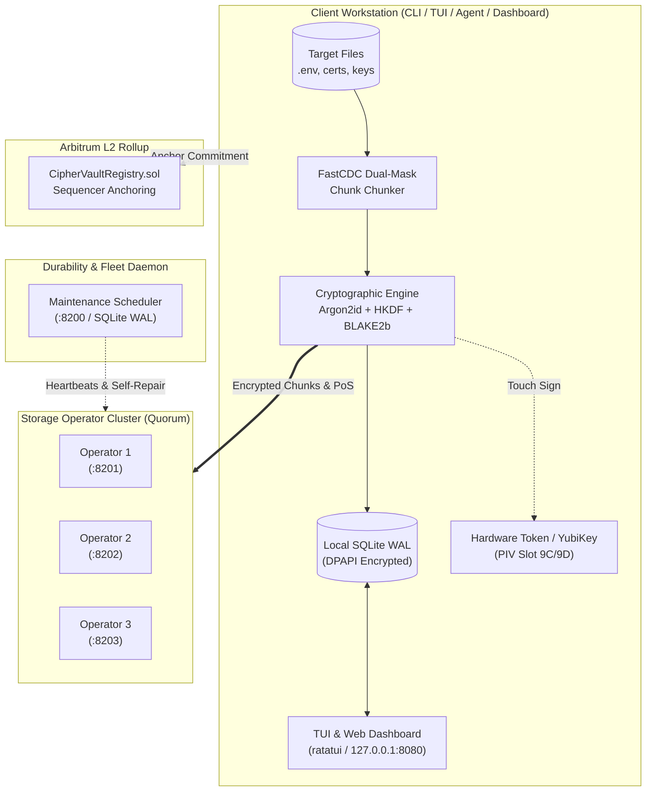
</details>

---

## 2. Distributed System Components

| Component | Technology | Primary Responsibilities | Network / Process Boundary |
|---|---|---|---|
| **CipherVault CLI** (`apps/cli`) | Rust, Tokio, Clap, Axum | Command-line interface for init, tracking, snapshots, anchoring, guardian ceremonies, and web dashboard hosting. | Local Client Workstation |
| **CipherVault Agent** (`apps/agent`) | Rust, Notify, Crossbeam | Background file-watcher service detecting secret file modifications and triggering debounced automated snapshots. | Local Daemon Service |
| **Local Store** (`crates/local-store`) | SQLite WAL, DPAPI, Rusqlite | Transactional persistence of tracked file manifests, snapshot history DAG, device certificates, and durable upload queues. | `.ciphervault/vault.db` |
| **Crypto Core** (`crates/crypto`) | ChaCha20-Poly1305, Ed25519, X25519, BLAKE2b, Shamir $\text{GF}(2^8)$ | Key hierarchy derivation, authenticated encryption, threshold secret sharing, and PIV APDU smartcard driver. | In-memory zeroized structures |
| **Snapshot Engine** (`crates/snapshot`) | Pure-Rust FastCDC, Gear Hash | Content-defined chunking, deduplication detection, snapshot serialization (canonical CBOR), and atomic restore. | In-memory stream processing |
| **Storage Operator** (`services/operator`) | Rust, Axum, RocksDB/Disk | Untrusted federated storage nodes holding encrypted chunks, serving PoS challenges, and storing recovery envelopes. | HTTP REST (`:8201-8203`) |
| **Maintenance Daemon** (`services/maintenance`) | Rust, Reqwest, Rusqlite | Continuous heartbeat probing, replica quorum auditing, PoS integrity verification, and autonomous self-repair. | HTTP REST (`:8200`) |
| **Arbitrum Registry** (`contracts/CipherVaultRegistry.sol`) | Solidity (0.8.28), Foundry | On-chain registration of state commitments (`setCommitment`), salt binding, and sequencer receipt validation. | Arbitrum One / Sepolia L2 |

---

## 3. Cryptographic Key Hierarchy

The CipherVault security model branches from a single 256-bit high-entropy Master Recovery Secret ($R$). All operational keys are derived deterministically via domain-separated HKDF-BLAKE2b trees:

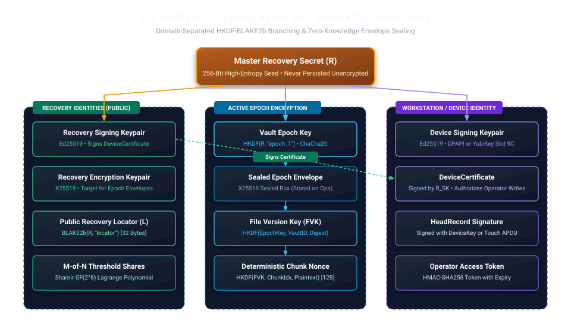

<details>
<summary><b>View Mermaid Source Code</b></summary>

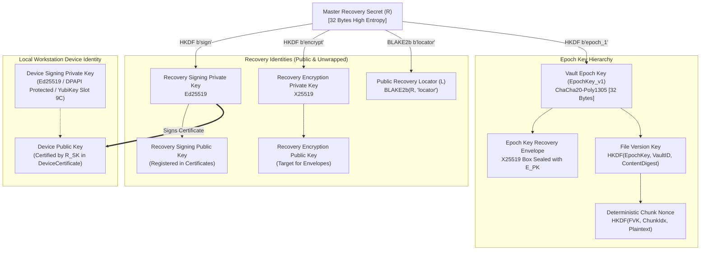
</details>

---

## 4. End-to-End Operational Workflows

### Workflow 1: Vault Initialization (`ciphervault init`)

Initialization bootstraps a zero-knowledge confidential environment on the developer's machine without transmitting keys across any network:

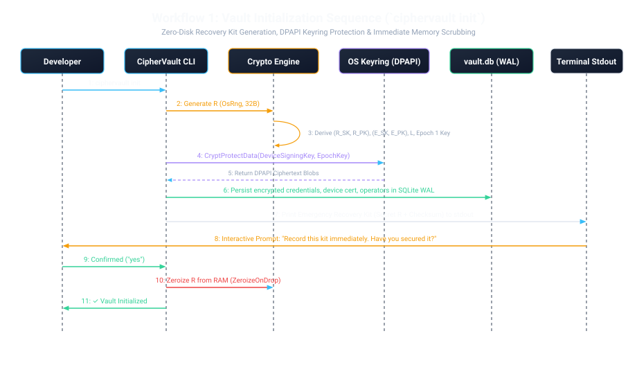

<details>
<summary><b>View Mermaid Source Code</b></summary>

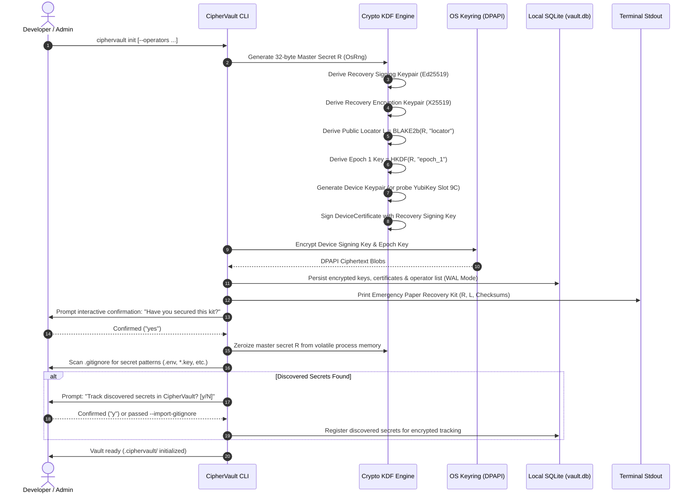
</details>

**Security Invariants Enforced:**
* The paper kit contains the ONLY instance of $R$ in the universe.
* If the workstation is decommissioned, zero readable keys exist in `.ciphervault/vault.db` without Windows user logon credentials.
* `git status` automatically ignores `.ciphervault/` to prevent repository leaks.
* **Smart `.gitignore` Leak Defense & Discovery**: `ciphervault init` inspects `.gitignore` to onboard existing project secrets into encrypted tracking. Whenever secrets are tracked via `ciphervault track <path>`, CipherVault automatically verifies and appends them to `.gitignore` (unless `--no-gitignore` is specified), preventing plaintext secrets from ever being staged or committed to Git.

---

### Workflow 2: File Tracking & Snapshot Creation (`ciphervault push`)

When a developer changes secret files, `ciphervault push` executes content-defined chunking, deduplication checks, and encrypted replication:

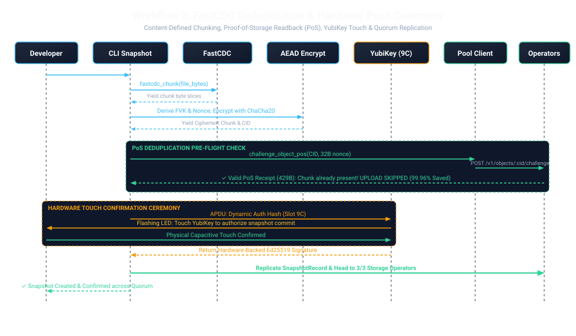

<details>
<summary><b>View Mermaid Source Code</b></summary>

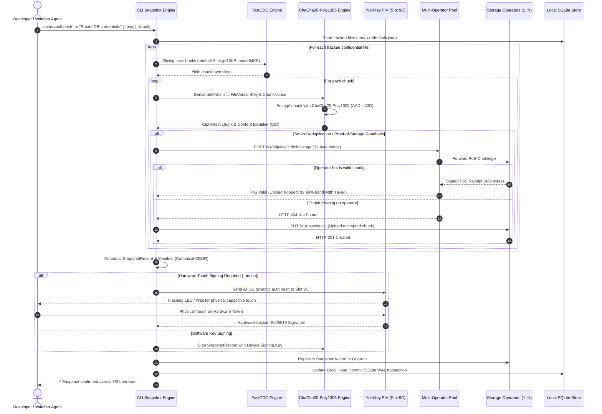
</details>

**Key Performance & Efficiency Gains:**
* **FastCDC Boundary Realignment**: Modifying a line in a file only changes 1 chunk; all other chunks retain identical CIDs.
* **Deterministic Version Keying**: Chunks are deduplicated across snapshots for the same vault, while remaining cryptographically isolated across different vaults.
* **PoS Readback Challenge**: Replaced 1–4 MB full chunk readbacks with a 461-byte cryptographic handshake.

---

### Workflow 3: On-Chain Settlement on Arbitrum L2 (`ciphervault anchor`)

For tamper-evident sequencing and regulatory compliance, state commitments can be anchored on Arbitrum L2:

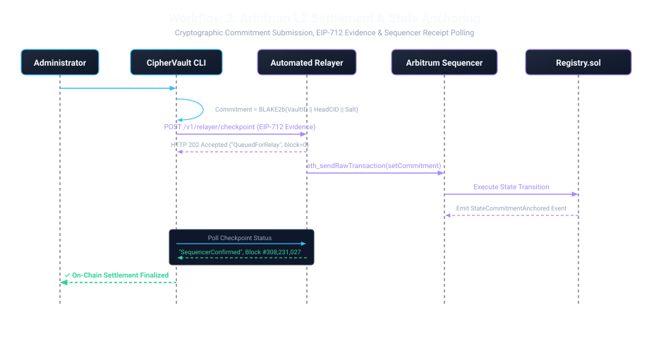

<details>
<summary><b>View Mermaid Source Code</b></summary>

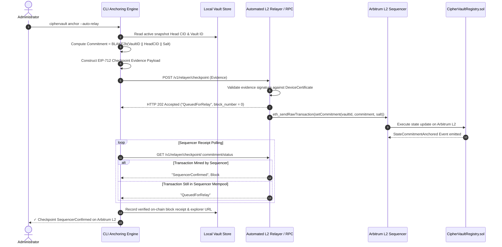
</details>

---

### Workflow 4: Autonomous Fleet Durability & Self-Repair (`ciphervault-maintenance`)

The maintenance daemon runs as a continuous system service to ensure 3-of-3 replica durability across untrusted operator nodes:

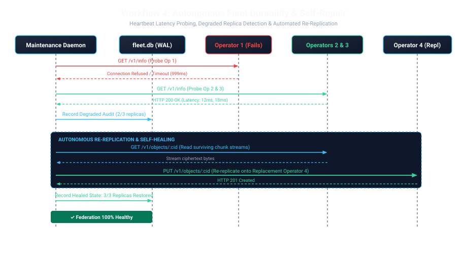

<details>
<summary><b>View Mermaid Source Code</b></summary>

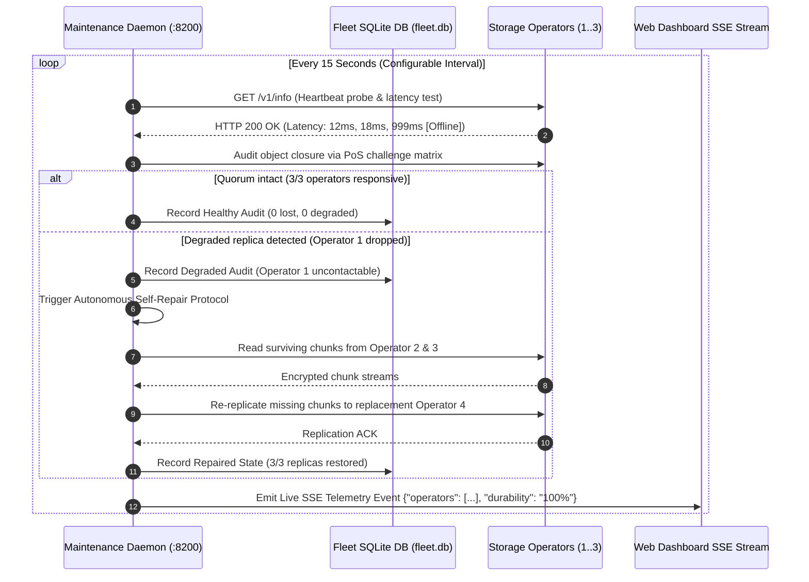
</details>

---

### Workflow 5: Catastrophic Workstation Loss & Clean-Machine Disaster Recovery (`ciphervault recover`)

When the original development machine is destroyed, stolen, or lost, recovery proceeds onto a blank machine using **zero cached disk credentials**:

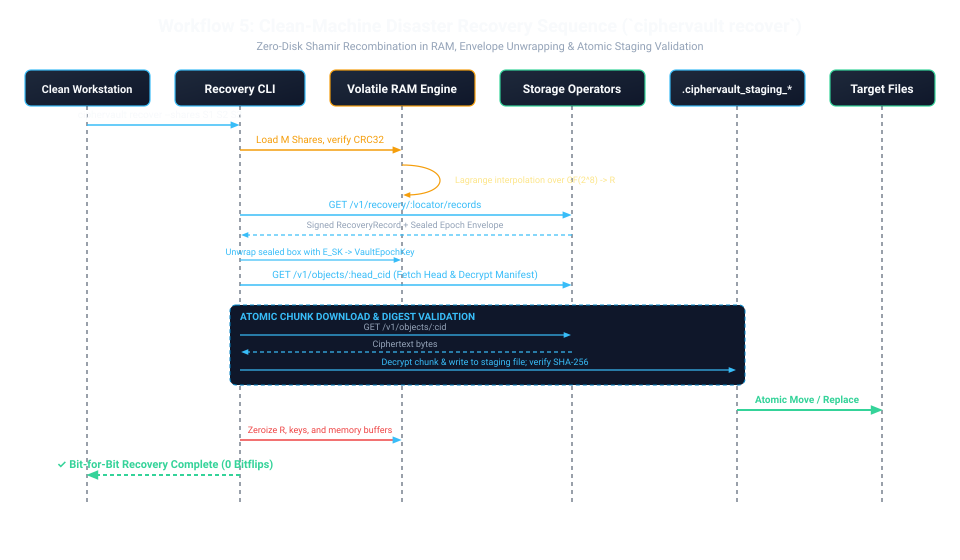

<details>
<summary><b>View Mermaid Source Code</b></summary>

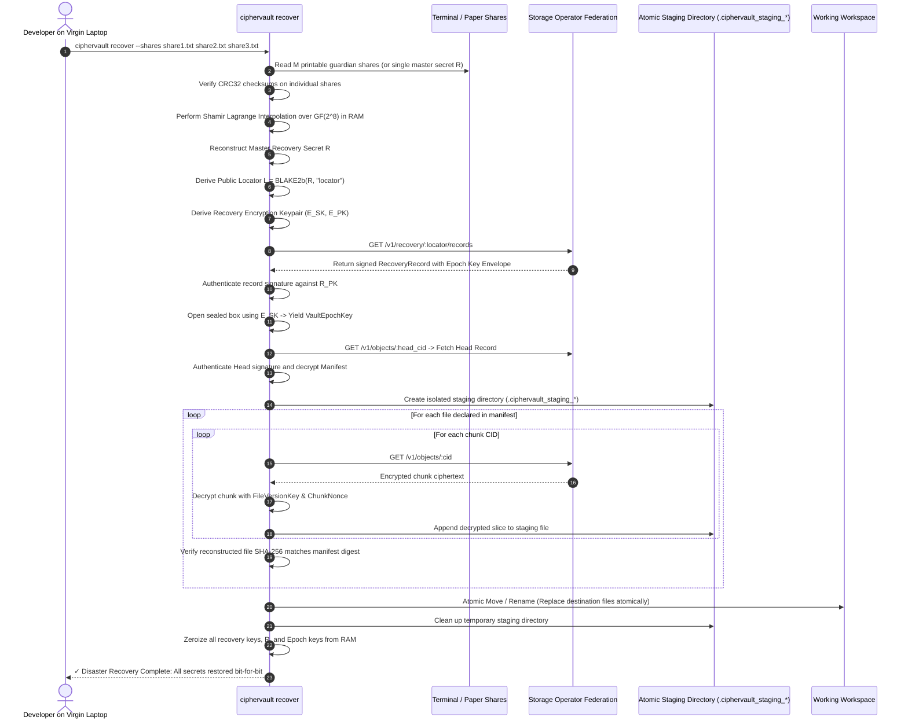
</details>

**Clean-Machine Guarantees:**
* **Zero Host Plaintext Dependency**: No passwords or cached keys required from the destroyed machine.
* **Atomic All-or-Nothing Integrity**: If a single chunk is corrupted or truncated, staging files are deleted; target files are NEVER left in a partial state.
* **100% Bit-for-Bit Fidelity**: Restored `.env` and cryptographic keys have zero byte discrepancy against original files.

---

### Workflow 6: Zero-Disk Secret Injection & Subprocess Execution (`ciphervault run`)

To eliminate plaintext `.env` files from developer laptops and production instances, `ciphervault run` streams secrets directly into child process environments:

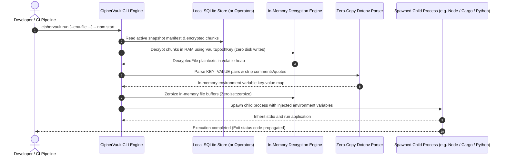

**Zero-Disk Security Invariants:**
* Plaintext credentials never touch disk, SSD swap blocks, or temporary files.
* Decrypted buffers are wiped with memory zeroization before child execution begins.
* `--dry-run` enables developers and security teams to inspect configured variable names without printing secret values or executing commands.

---

### Workflow 7: Autonomous Background File Watcher & Automated Sync (`ciphervault watch`)

CipherVault supports two distinct developer operating modes:
1. **Manual Mode (`ciphervault push`)**: Traditional Git-style explicit commits with user-supplied commit messages.
2. **Automated Continuous Mode (`ciphervault watch --sync`)**: Hands-off, real-time background synchronization whenever secrets are updated in developer editors (VS Code, Cursor, IntelliJ, etc.).

```mermaid
sequenceDiagram
    autonumber
    actor Dev as Developer (Editor: VS Code / Cursor)
    participant FS as Host Filesystem (.env)
    participant Watcher as Autonomous Agent (ciphervault watch)
    participant Debounce as 2s Sliding Debounce Buffer
    participant CDC as FastCDC Engine
    participant AEAD as ChaCha20-Poly1305 Engine
    participant Ops as Storage Operator Federation

    Dev->>FS: Saves tracked secret (Ctrl+S in Editor)
    FS->>Watcher: Kernel event notification (ReadDirectoryChangesW / inotify / FSEvents)
    Watcher->>Watcher: Check path matches tracked secrets & ignore filters
    Watcher->>Debounce: Register modification event
    Note over Watcher,Debounce: Sliding 2-second debounce window collapses rapid multi-saves
    Debounce->>Watcher: Window elapsed; trigger coherent read
    Watcher->>FS: Read confidential file bytes & verify write completion
    Watcher->>CDC: Slices file using FastCDC Gear rolling hash
    CDC-->>Watcher: Dynamic chunk slices
    Watcher->>AEAD: Encrypt chunks under FileVersionKey & deterministic nonce
    AEAD-->>Watcher: Encrypted chunks & CIDs
    Watcher->>Ops: Replicate new chunks & update snapshot Head
    Ops-->>Watcher: Replication confirmation (3/3 operators durable)
    Watcher-->>Dev: Console notification: Snapshot auto-captured and pushed
```

**Watcher Invariants & Guarantees:**
* **Native Kernel Event Drivers**: Utilizes `ReadDirectoryChangesW` (Windows), `inotify` (Linux), and `FSEvents` (macOS) for sub-millisecond save detection with zero CPU polling overhead.
* **Sliding Debounce Window**: Defaults to 2 seconds (`--debounce <SECS>`) to collapse multiple rapid editor saves or autosaves into a single coherent snapshot.
* **Coherent Read Validation**: Verifies that the file write lock is released and complete before reading bytes into memory.
* **Content-Defined Deduplication**: FastCDC guarantees that localized edits only re-encrypt changed chunks, minimizing network payload to the cluster.
* **One-Click Launch**: Can be started in the background via `start-watcher.bat` or added to workstation startup scripts.

---

### Workflow 8: Encrypted Secret Diffing & Shoulder-Surfing Defense (`ciphervault diff`)

Developers and security engineers can inspect changes between secret revisions without exposing plaintext values to screen recorders or shoulder surfers:

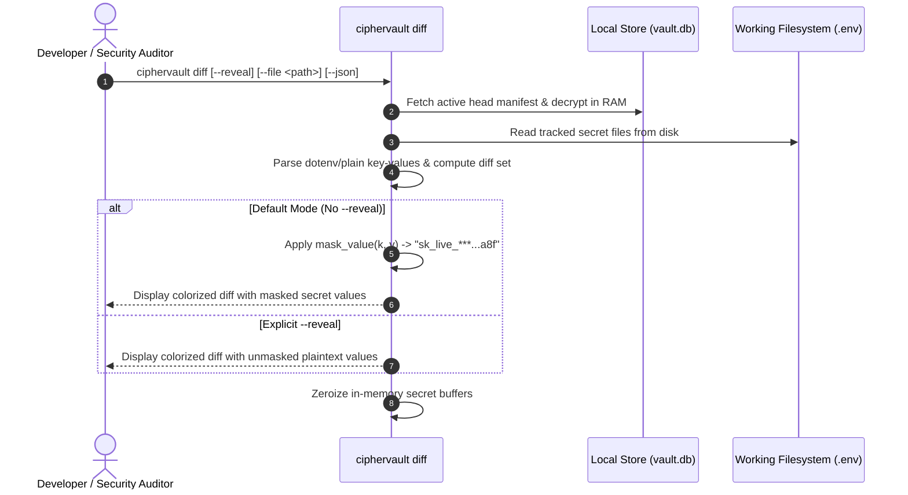

* **Default Shoulder-Surfing Mask**: All secret values display as `***...` with leading and trailing hint characters unless `--reveal` is explicitly passed.
* **Revision Modes**: Compares working tree vs head (`ciphervault diff`), working tree vs specific snapshot (`ciphervault diff <snap_id>`), or between two snapshots (`ciphervault diff <snap_a> <snap_b>`).
* **Format-Aware**: Performs semantic key-level diffing for `.env` files (added, removed, modified, unchanged) and line-level diffing for general confidential files.

---

### Workflow 9: Multi-Workstation Synchronization (`ciphervault pull`)

When collaborating across team laptops or updating build servers, `ciphervault pull` updates secrets securely:

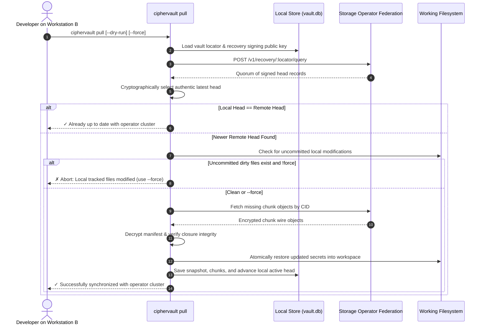

---

### Workflow 10: Zero-Disk Secret Execution in CI/CD Runners

Automated build and release pipelines inject secrets dynamically without persistent disk writes:

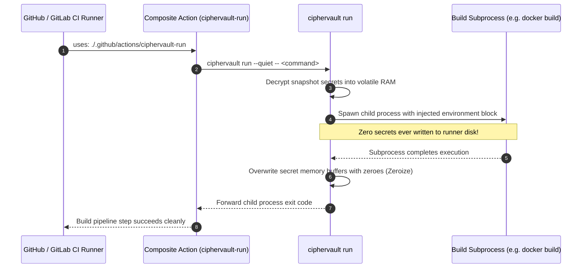

---

### Workflow 11: Dynamic P2P Operator Discovery & Gossip Protocol

Decentralized operator clusters discover active peers dynamically without requiring static IP configuration:

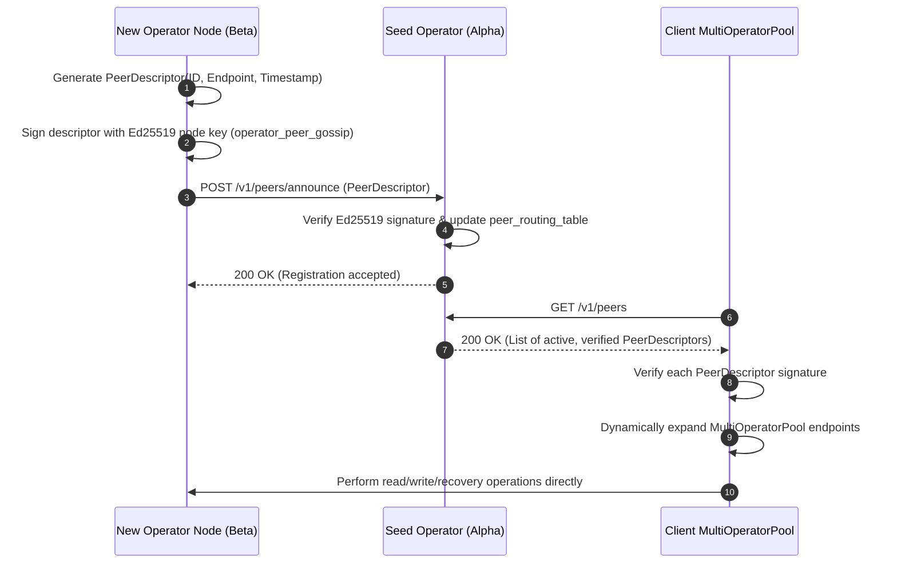

---

### Workflow 12: Out-of-Band Push Approvals for Emergency Disaster Recovery

Clean-machine emergency recovery can be gated upon out-of-band cryptographic approval receipts signed by authorized team leads or guardians:

```mermaid
sequenceDiagram
    autonumber
    participant Target as Recovering Machine (ciphervault recover --require-approval)
    participant Cluster as Operator Federation
    participant Lead as Security Lead / Approver (ciphervault approve)

    Target->>Target: Generate ApprovalChallenge(VaultID, Action, TTL=600s)
    Target->>Cluster: POST /v1/auth/challenges (Broadcast challenge)
    Cluster-->>Target: Challenge registered; awaiting approval receipt
    
    Lead->>Cluster: GET /v1/auth/challenges/pending (ciphervault approve list)
    Cluster-->>Lead: List of active challenges with details and TTL
    Lead->>Lead: Review target directory, vault ID, and action
    Lead->>Lead: Sign challenge with device/guardian key (out_of_band_approval)
    Lead->>Cluster: POST /v1/auth/challenges/:id/approve (SignedApprovalReceipt)
    Cluster->>Cluster: Verify receipt signature & mark challenge approved
    
    loop Polling (Every 500ms, up to TTL)
        Target->>Cluster: GET /v1/auth/challenges/:id
        Cluster-->>Target: 200 OK (approved: true, receipts: [SignedApprovalReceipt])
    end
    Target->>Target: Verify approver signature & proceed with snapshot restoration
```

---

## 6. Security Invariants Matrix

| Attack / Failure Vector | Mitigating Subsystem | Cryptographic / Architectural Guarantee |
|---|---|---|
| **Workstation Theft / Disk Forensic Dump** | OS Keyring Encrypted Store | Local SQLite database keys are DPAPI-encrypted; master secret $R$ is zeroized from disk and RAM. |
| **Storage Operator Compromise / Rogue Host** | AEAD Client-Side Encryption | Operators only store encrypted chunks ($CID = \text{BLAKE2b}(C)$); zero plaintext or file paths are ever sent. |
| **Malicious Operator Record Injection** | Cryptographic Authorization Boundary | `POST /v1/recovery/:locator/records` verifies Ed25519 signatures against $R_{PK}$ or valid `DeviceCertificate`. |
| **Man-in-the-Middle Checkpoint Spoofing** | Live Arbitrum L2 Settlement | Checkpoints include EIP-712 structured evidence and sequencer receipt verification against `CipherVaultRegistry.sol`. |
| **Single Operator Outage / Data Center Fire** | Multi-Operator Quorum & Maintenance | 3-node replication with autonomous fleet repair reconstitutes degraded chunks onto healthy operators. |
| **Key Extraction via Debugger / Memory Dump** | `ZeroizeOnDrop` Hygiene | `RecoverySecret`, `VaultEpochKey`, and `FileVersionKey` wipe stack and heap buffers immediately upon falling out of scope. |
| **Corrupted Download During Restore** | Atomic Staging Directory | Chunks are assembled in `.ciphervault_staging_*` and validated against declared SHA-256 digests before touching working directories. |
| **Unauthorized Snapshot Commit** | Hardware Token (YubiKey PIV) | Enforces physical capacitive touch confirmation (`Slot 9C`) before signing snapshot head records. |
| **Shoulder Surfing / Visual Secret Leakage** | Encrypted Diff Engine | Secret values in `ciphervault diff` masked with `***` unless `--reveal` is explicitly supplied. |
| **Accidental Overwrite on Remote Pull** | Working Tree Dirty Guard | `ciphervault pull` aborts if local tracked files have uncommitted edits unless `--force` is given. |
| **CI/CD Plaintext Disk Persistence** | Zero-Disk Secret Injection | `ciphervault run` passes decrypted secrets strictly via in-memory process environment blocks. |
| **Cache-Timing / Branch Microarchitectural Attacks** | Branchless $\text{GF}(2^8)$ Galois Field Arithmetic | Elimination of secret-dependent branches in Shamir Secret Sharing multiplication via bitwise masking. |
| **Rogue Operator Impersonation & Sybil Attacks** | P2P Signed Gossip Descriptors | Peer discovery requires Ed25519 domain-separated signatures (`operator_peer_gossip`) with timestamp freshness. |
| **Unapproved Clean-Machine Secret Extraction** | Out-of-Band Push Authorization | Emergency recovery enforced through cryptographic challenge receipts signed by team leads or threshold guardians. |

---

## 7. Verification Commands & Diagnostics

To verify the operational workflow on any environment:

```powershell
# 1. Run Complete Rust Workspace Test Suite
cargo test --workspace --locked --offline

# 2. Run Hardware Smartcard APDU Ceremony Tests
cargo test --test hardware_token --locked --offline

# 3. Run End-to-End Multi-Operator Chaos & Disaster Drill
powershell -ExecutionPolicy Bypass -File deploy/chaos_drill.ps1

# 4. Verify Live Arbitrum Settlement Deployer
node scripts/deploy-registry.cjs --network arbitrum_sepolia

# 5. Launch Hardened Production Ingress & Multi-Container Cluster
docker compose -f deploy/docker-compose.prod.yml up -d
docker compose -f deploy/docker-compose.prod.yml ps

# 6. Run Automated Staging & Disaster Verification Drill
powershell -ExecutionPolicy Bypass -File scripts/verify-cluster.ps1

# 7. Launch Interactive Terminal Operations Console (TUI)
ciphervault tui
# or run the one-click Windows launcher:
.\launch-tui.bat

# 8. Launch Autonomous File Watcher Daemon
ciphervault watch --debounce 2 --sync
# or run the one-click Windows launcher:
.\start-watcher.bat
```
