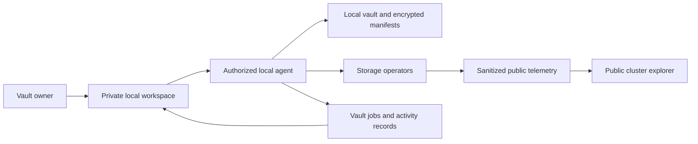

# CipherVault web dashboard and explorer audit

**Reviewed:** 13 September 2026  
**Purpose:** Product, functionality, information accuracy, security boundary, UX, and GUI review to support an implementation plan.  
**Surfaces:** Hosted dashboard at https://vault.cipherv.online, local web UI, supporting CLI handlers, storage models, and deployment configuration.  
**Source baseline:** `0d6dfcfc0ff6d22541236d49b506dcf13caba249`; current working source was inspected. The deployed binary's commit was not established.  
**Deliverable status:** Audit and recommendations only. Application code and deployment were not changed.

## 1. Executive assessment

CipherVault has useful foundations: real operator probes, recovery-set audits, encrypted snapshot records, a masked diff engine, file tracking, and recovery tooling. The web interface does not yet assemble these into a dependable personal vault explorer.

The most important problem is identity and execution context. The cloud dashboard operates against the server's working-directory vault. Opening it from another developer's CLI does not connect that developer's files or private vault state. The CLI appends a vault ID to the URL, but the frontend does not consume that parameter and the API handlers do not select an authorized user vault from it.

The second problem is trust in displayed information. Several prominent claims are static, inferred from the wrong evidence, or disconnected from their backend contracts. Live inspection found duplicate snapshots, a visually inaccessible detail drawer, misleading checkpoint confirmation, and missing fleet fields. A visual redesign should be built on corrected data contracts rather than polishing these claims.

**Recommended product direction:**

1. A **public cluster explorer** for explicitly public operator and checkpoint information.
2. A **private vault workspace** for an owner's files, history, changes, backup jobs, and recovery readiness.
3. An **operator administration view** for authorized fleet managers.

The owner's first screen should answer: **Which vault am I viewing? What changed? What is backed up? Can I recover it? What needs attention?**

## 2. Scope, evidence, and limitations

### What was reviewed

- All nine navigation areas: Storage Operators, Snapshot DAG, Secret Diff, Tracked Secrets, Threshold Guardians, Arbitrum Relayer, Maintenance Fleet, Emergency Kit, and FastCDC Inspector.
- Header actions, snapshot drawer, tracking/untracking flows, modal handling, keyboard shortcuts, search, polling, SSE, and the terminal panel.
- The live interface at the normal desktop viewport and a 390 × 844 mobile viewport.
- Frontend HTML/CSS/JavaScript and the backing Axum routes in the CLI.
- Snapshot persistence, manifest and chunking implementation, maintenance data types, and web deployment files.
- Existing UI regression checks, executed successfully.

### Evidence labels

- **Live:** Observed in the hosted interface during this review.
- **Source:** Directly supported by inspected code; production deployment may differ.
- **Inference:** A consequence supported by the code, but not exercised end to end.
- **Recommendation:** Proposed future behavior, not an existing feature.

The review did not deliberately restore or untrack production files, submit checkpoints, split recovery secrets, reveal secret values, or perform an intrusive penetration test. Normal page initialization itself triggers API activity, including audits, fleet updates, and automatic FastCDC inspection. No real recovery material was entered. No claim of production compromise is made.

The deployed UI showed two tracked files consistent with the container's seeded example data. That is evidence of the server's displayed inventory, not evidence that arbitrary visitors' vaults are connected. Source and deployment correspondence must be established before closing findings.

This is a comprehensive dashboard review, not a cryptographic certification, infrastructure penetration test, full accessibility conformance assessment, or proof that all failure states have been exercised.

### Main source references

Paths below are repository-relative for portability; line numbers identify the reviewed baseline and may move.

| Reference | Relevant location |
|---|---|
| UI structure and initial claims | `apps/ui/index.html`, especially lines 112–148, 455, 569, 843, 1083, 1142 |
| Fetching and status rendering | `apps/ui/app.js:50`, `:77`, `:135`, `:183`, `:195` |
| History and inventory | `apps/ui/app.js:392`, `:457`, `:2387` |
| Checkpoint and fleet rendering | `apps/ui/app.js:508`, `:678`, `:743` |
| Recovery actions | `apps/ui/app.js:1134`, `:1337` |
| Streaming and inspector | `apps/ui/app.js:1582`, `:1665`, `:1826`, `:1950` |
| Diff, file management, terminal | `apps/ui/app.js:2033`, `:2114`, `:2252`, `:2541` |
| Vault selection and UI routing | `apps/cli/src/main.rs:631`, `:3969`, `:4020` |
| Inventory and history APIs | `apps/cli/src/main.rs:4133`, `:4264` |
| Recovery and maintenance APIs | `apps/cli/src/main.rs:4377`, `:4417`, `:4552`, `:4619`, `:4672` |
| Inspector and secret APIs | `apps/cli/src/main.rs:4958`, `:5103`, `:5175`, `:5193` |
| Snapshot aliases and listing | `crates/local-store/src/db.rs:396`, `:635` |
| Actual padding and chunking | `crates/snapshot/src/chunker.rs:12`, `:33` |
| Recovery audit fields | `services/maintenance/src/engine.rs:12` |
| Fleet response types | `services/maintenance/src/db.rs:14` |
| Frontend regression suite | `apps/ui/audit.test.cjs` |
| Deployment | `deploy/docker/entrypoint-dashboard.sh`, `deploy/gcp/docker-compose.web.yml`, `deploy/gcp/Caddyfile.web.gcp` |

Local visual evidence includes `docs/review-evidence/dashboard-2026-09-13/history-desktop.png`. The evidence directory is ignored by Git, so screenshots will not accompany the report in a commit unless deliberately included. Findings are documented in text so the report remains independently useful.

## 3. Prioritized findings

Priority definitions: **P0** must be addressed before exposing private vault administration; **P1** prevents reliable core use; **P2** improves usability, resilience, and maintainability; **P3** is a later enhancement.

### F01 — P0: The cloud URL does not connect the user's vault

**Evidence: Source; live context consistent with server-seeded inventory.** `cmd_ui` opens `/?vault=<id>`. No `URLSearchParams` or equivalent vault selection appears in the frontend. Requests use unscoped routes such as `/api/vault`; handlers call `get_vault_store()`, which opens the process's working-directory database.

**Impact:** A visitor can mistake server inventory for their own. “Track,” “Push,” and “Restore” refer to the server's files when this backend is hosted. Adding a URL parameter alone cannot prove vault ownership or make local files accessible remotely.

**Required change:** Establish explicit public, local, and authenticated remote contexts. Show vault name, owner/workspace, device, connection mode, and short ID. Reject unauthorized or unknown vault IDs. Never fall back silently to a shared vault.

**Acceptance:** Two independent users see only their permitted vaults. An unknown ID produces a useful access/not-found state without exposing another vault. Launching from a local project opens or pairs the correct private workspace.

### F02 — P0: Administrative and secret-bearing routes lack an application access boundary

**Evidence: Source.** The router exposes tracking, untracking, snapshot creation/restoration, guardian operations, diff reveal, FastCDC inspection, and `/api/secrets/inspect` without an authentication/authorization layer in the inspected router. The supplied Caddy configuration proxies the application without a route-specific access gate. The secrets-inspection handler includes `raw_value` in its JSON output.

**Impact:** If reachable with an initialized vault, these routes can expose private material or act on the backend's files. A masked display does not protect plaintext already returned in a response. The review did not fetch the raw-secret endpoint or exploit these routes on production.

**Required change:** Separate public and private routers; deny access by default; authorize every vault operation; remove raw values from ordinary metadata APIs. Add short-lived, scoped sessions and audit sensitive actions. Apply origin/Host validation and CSRF defenses appropriate to the chosen session model, including loopback deployments. CORS alone is not access control.

**Acceptance:** Anonymous and cross-vault requests fail safely, including direct API requests. Ordinary responses contain no raw secrets, shares, or key material. Public endpoints are explicitly allowlisted and tested.

### F03 — P0: Recovery UI invites users to send offline recovery material to the server

**Evidence: Source and live controls.** Guardian split sends `recovery_secret_hex` to `/api/guardians/split`; recombination sends share strings to `/api/guardians/reconstruct`. The hosted UI presents these as zero-knowledge or zero-leakage operations. Frontend inputs and state also retain strings without a complete sensitive-data lifecycle.

**Impact:** In hosted mode, the backend receives the root secret or enough shares to reconstruct it. Rust zeroization of selected buffers does not establish that browser strings, request bodies, proxy buffers, or all intermediate copies are erased.

**Required change:** Remove these input flows from the public dashboard. Prefer local CLI/native recovery ceremonies. Any future browser ceremony needs an explicit local execution model, reviewed cryptography, clear handling rules, and no claim that JavaScript provides guaranteed memory erasure.

**Acceptance:** A public dashboard never requests real recovery material. Recovery status records setup/drill evidence without storing the secret or shares. Any training simulation uses clearly labeled synthetic data.

### F04 — P0: FastCDC file inspection has an insufficient file-access boundary

**Evidence: Source.** The handler rejects paths containing `..` or starting with `/`, then reads a `PathBuf`. It does not require membership in the tracked-file set or establish a canonical vault-root boundary. It returns a preview of chunk bytes. String checks do not cover all Windows absolute paths or symlink/junction escape cases.

**Impact:** A diagnostic endpoint can become an unintended server-file disclosure surface. The normal frontend also automatically inspects the first tracked file during initialization, even before the user opens the inspector.

**Required change:** Remove server-path input from public inspection. For private inspection, resolve authorized file IDs against the selected vault and reject escapes using platform-aware filesystem rules. Bound bytes, computation, and result size. Prefer metadata-only inspection of stored objects; require an explicit private action for content previews.

**Acceptance:** Untracked files, absolute/drive/UNC paths, symlink escapes, and oversized inputs are rejected. Opening the dashboard does not automatically load plaintext previews.

### F05 — P1: Snapshot detail drawer never becomes visually visible

**Evidence: Live and source.** Clicking “Inspect Manifest” populates the drawer, but JavaScript adds `open`; CSS expects `.drawer.drawer-open`. The backdrop similarly expects `active`, while JavaScript adds `open`. Live DOM inspection found `class="drawer open"` with a 520px translation and an x position of 1265px, beyond the viewport.

**Impact:** The central explorer action appears broken. The offscreen dialog is still exposed to accessibility APIs.

**Required change:** Use one shared state convention, apply hidden/inert semantics while closed, move focus into the opened drawer, trap focus appropriately, and restore focus when it closes.

**Acceptance:** Mouse and keyboard activation reveal a visible, usable drawer and backdrop. A closed drawer is not focusable or announced as an active dialog. Tests assert actual geometry/visibility, not only a class name.

### F06 — P1: Snapshot history duplicates records and can invent an active head

**Evidence: Live and source.** The live history showed the same snapshot twice, both labeled “ACTIVE HEAD.” `save_snapshot` stores aliases under logical snapshot ID and record CID; `list_snapshots` selects every row. The frontend also uses `snap.is_head || idx === 0`.

**Impact:** Counts, comparisons, navigation, and the history timeline become misleading. The first displayed record can be labeled head without evidence.

**Required change:** Return one canonical entry per snapshot record; expose logical ID and record CID separately. Use only authoritative head data. Show parent relationships accurately, or call the display “Snapshot history” rather than a DAG.

**Acceptance:** One captured snapshot produces one entry. Head state remains correct with alias records, reordered results, branching, and no active head.

### F07 — P1: Historical details show the current tracked inventory

**Evidence: Source.** `openSnapshotDrawer` renders `state.vault.tracked_files` rather than loading the selected snapshot's manifest. It adds an unconditional statement that the snapshot is pinned across three operators.

**Impact:** A user inspecting an old backup sees today's paths and sizes and may infer recoverability that was never checked for that backup.

**Required change:** Add a snapshot-scoped manifest endpoint or local read model. Show that snapshot's file versions, sizes, tombstones, and object references. Attach audit evidence to the same immutable snapshot/closure identifier.

**Acceptance:** A file added after snapshot A does not appear in A. A file subsequently removed remains visible in A's historical inventory. Historical replica status is unknown until appropriate evidence exists.

### F08 — P1: Retention, chunk counts, padding, and protection labels are misleading

**Evidence: Live and source.** The ribbon hardcodes “90 Days Min” and “Automated Lease Self-Repair Active.” Inventory estimates chunks as `size / 1 MiB + 1`; the table claims 1 MiB padded chunks and HTML describes PKCS#7 padding. Actual chunking uses FastCDC with 4/16/64 KiB boundaries and a 4 KiB zero-padding bucket for small files. The inventory is based on tracked paths and current filesystem sizes, not snapshot coverage.

**Impact:** Users cannot judge storage use, remaining retention, or whether tracked files have actually been backed up. A missing file can be shown as zero bytes rather than missing.

**Required change:** Use manifest/object measurements and actual lease receipts. Distinguish “Tracked,” “Changed locally,” “Captured,” and “Verified remotely.” Missing, unavailable, and zero are separate states. Label advertised policy separately from remaining lease time.

**Acceptance:** Inventory values agree with the selected manifest; expiry decreases with time; unknown expiry is not rendered as 90 days; unsnapshotted files are not counted as verified backups.

### F09 — P1: Checkpoint screen reports confirmation without sufficient evidence

**Evidence: Live and source.** The live page displayed a block number and “SequencerConfirmed” alongside all-zero contract and transaction fields and an Arbiscan link. The checkpoint ledger was empty. `renderAnchors` leaves initial confirmation labels intact, and the relayer API infers confirmation from a nonzero transaction hash rather than a current verification result.

**Impact:** Users can mistake a prepared commitment or recorded metadata for verified inclusion. Hash recomputation proves a commitment relationship, not chain inclusion or finality.

**Required change:** Model prepared, queued, submitted, included, verified, failed, and unknown states explicitly. Preserve network identity, receipt status, verification time, contract, block hash, and snapshot association. Reject all-zero and malformed transaction hashes as explorer-link targets. Never default unknown chains to a different network.

**Acceptance:** An all-zero receipt displays “Not submitted” or “Unknown,” no confirmation styling, and no transaction link. Local commitment verification is labeled separately from on-chain verification.

### F10 — P1: Relayer and fleet backend/frontend contracts disagree

**Evidence: Source and live symptoms.** `/api/relayer/checkpoints` returns an array with fields such as `tx_hash_hex` and `arbiscan_url`; the frontend expects an object containing `checkpoints`, with `tx_hash` and `explorer_url`. Fleet rendering expects `vault_id`, `head_cid`, `registered_at`, `operator_id`, `status`, and `last_heartbeat`; backend models provide fields such as `locator_hex`, `registered_at_utc`, `is_healthy`, and `last_seen_utc`.

**Impact:** The live fleet view had empty identities/heartbeat fields, a “Genesis” fallback, and 0 B allowance. These are not reliable facts about the underlying vault. The ledger can appear empty despite stored evidence.

**Required change:** Define versioned response schemas and one adapter per endpoint. Do not invent unavailable fields. Map locator and vault identity deliberately rather than treating them as interchangeable.

**Acceptance:** Tests use responses serialized by real backend types. Real records render correctly; unavailable allowance/head fields say “Not reported,” not zero or genesis.

### F11 — P1: Recovery kit screen resembles a usable kit but contains descriptors

**Evidence: Live and source.** The page offers “Print Physical Kit” and “Reveal Secret,” while the API returns public recovery descriptors. The visible checksum is `CRC32: -- (PASSED)`. The reveal button shows explanatory text, not a recoverable secret. `recovery export` normally prints descriptors when an existing kit file is absent.

**Impact:** Someone may print this page and wrongly believe they have the material needed for clean-machine recovery.

**Required change:** Rename this area “Recovery readiness.” Describe public descriptors as insufficient for recovery. Remove placeholder success and fake reveal controls. Record explicit kit acknowledgment and the outcome/date of a controlled recovery drill.

**Acceptance:** A descriptor printout is labeled “Not a recovery kit.” No checksum passes without an actual checked document. Setup instructions never imply a lost root secret can be regenerated from public descriptors.

### F12 — P1: Restore lacks a clear destination and safe preview

**Evidence: Source.** The drawer sends a snapshot ID without a destination. The API defaults to `.` and invokes server-side `cmd_restore`. The confirmation refers to “your workspace,” which is ambiguous in hosted mode. The CLI restore path reads local stored chunks; it is not itself the clean-machine network recovery workflow.

**Impact:** The action can affect a different machine than the user expects, and offers no visible file-conflict plan. Historical restore also loads the current epoch key before handling the selected record; cross-epoch behavior needs a targeted test.

**Required change:** Make execution device and destination explicit. Preview files and conflicts. Default to a new directory, with explicit overwrite choice. Separate local restore, missing-chunk retrieval, and disaster recovery. Resolve the key for the selected epoch.

**Acceptance:** A hosted visitor cannot restore onto the shared server. Restore A after editing local files requires a conflict decision and produces verified bytes at the stated destination. Old-epoch and missing-local-chunk cases have tested outcomes.

### F13 — P1: No durable activity model explains what is happening in a vault

**Evidence: Source and live.** SSE sends operator latencies and token presence, not vault jobs or file changes. The terminal records selected browser actions in memory. It is not a durable CLI log or cross-device audit trail. The live “STREAM ACTIVE” console showed zero events while the dashboard continued updating.

**Impact:** Users cannot follow background capture, upload retries, repairs, renewals, failures, or activity from another device.

**Required change:** Implement persisted, vault-scoped jobs and activity records; stream their updates. Show stage, progress, outcome, actor/device, source, and actionable failure details. Reconnect with a cursor and make retention limits visible.

**Acceptance:** A job started outside the browser appears in the correct vault. Reload and reconnection preserve history without duplicates. A failed replication remains visible until addressed.

### F14 — P1: Polling creates repeated backend work and can mix evidence

**Evidence: Source.** Every eight seconds, the frontend fetches eight API groups, including an active recovery audit and fleet probing. Every SSE connection also probes operators in sequence. Fleet GET opens/updates a database and registers the current vault. Requests are not assembled around one immutable head/version.

**Impact:** Work grows with viewers. A new head can appear beside an audit for an earlier head. One slow request can hold the overall refresh gate. Refresh clears audit status before fetching, creating avoidable flicker.

**Required change:** Separate scheduled collectors/jobs from read-only cached status. Use bounded concurrency, explicit timeouts, per-resource errors, and freshness timestamps. Join snapshot and audit information by immutable IDs. Suspend unnecessary work in hidden tabs and use backoff.

**Acceptance:** Additional viewers do not each trigger a full recovery audit. A head change cannot inherit an old verification badge. Stale data is labeled with the last successful observation.

### F15 — P2: Search and interactions do not survive refresh reliably

**Evidence: Live and source.** Entering a nonmatching file query initially hid rows; after polling the rows returned while the search remained active. Filters operate on current DOM rows, then rendering replaces those rows. Snapshot messages are accepted on push but the inspected path only prints them; they are not returned by the history API despite message-oriented search copy.

**Required change:** Store filters, selection, sort, pagination, and drawer context in application state. Reapply after refresh. Persist messages if they are part of the product promise. Use navigable URLs for authorized file/snapshot pages, without secret values in URLs.

**Acceptance:** Search, focus, selected snapshot, and comparison remain stable through updates. Back/forward restores location. Empty search results provide an explicit message and clear-filter action.

### F16 — P2: Diff presentation needs precise semantics and reveal behavior

**Evidence: Source.** The reveal toggle rerenders cached results; a masked backend response cannot become plaintext without another authorized fetch. The “files changed” count uses all report files, although the backend adds reports for each selected path, including unchanged files. Non-dotenv formats use text comparison; this is not a structured JSON/YAML semantic parser. Frontend inference of file creation/deletion from key-change counts can misclassify edits to existing files.

**Required change:** Return explicit file status and changed-file totals. Define semantic versus byte comparison. Preserve file existence separately from empty content. On reveal, request values only in the private context with explicit scope and remask behavior. Treat binary files as binary.

**Acceptance:** Equal files show zero changed files; adding a key to an existing file does not label the file created. Reveal state matches the content actually available. Parsing failures are visible rather than silently treated as empty data.

### F17 — P2: FastCDC demonstrations are presented as storage evidence

**Evidence: Source and live labels.** The inspector hashes raw chunk slices, whereas stored CIDs come from encrypted wire objects. It labels unique slices “Stored with Retention Lease” and duplicates “0 Wire Bytes,” despite performing analysis rather than an upload/lease operation. Uploads are read as text and posted to the backend, which is inappropriate for arbitrary binary inputs and unexpected for a secrets-oriented tool.

**Required change:** Separate a synthetic chunking lab from actual vault object inspection. Label raw fingerprints, encrypted object CIDs, theoretical duplicate bytes, and measured uploaded bytes distinctly. Do not imply lease creation. Use local byte processing for a future upload inspector.

**Acceptance:** A workload analysis cannot claim storage or replication. Actual object views use manifest-backed encrypted CIDs and receipts. Binary inputs preserve their bytes or are explicitly unsupported.

### F18 — P2: Errors, defaults, and accessibility require behavioral verification

**Evidence: Source and live.** Many failed requests only log warnings or keep previous/default content. `showToast` ignores severity arguments and always draws a checkmark. Some initialized defaults say healthy/active before evidence. Closed drawer semantics are incorrect. Nine tabs exist, but numeric shortcuts cover only eight and the help list disagrees with actual order.

**Required change:** Introduce shared loading/empty/error/stale/unauthorized states; persistent actionable errors; severity-aware notifications; consistent accessible components. Preserve the existing skip link, focus styling, tab arrow navigation, and reduced-motion support.

**Acceptance:** Network and schema failures never look like successful empty results. Keyboard and screen-reader workflows are tested in the rendered app. No positive badge is inferred from a missing response.

### F19 — P1: Current container entrypoint conflicts with the new CLI default

**Evidence: Source; inference about a rebuild.** The entrypoint runs `ciphervault ui --host 0.0.0.0 --port 8080 --no-browser` without `--local`. In the reviewed CLI, the default cloud path prints/opens the cloud URL and returns; only `--local` starts the HTTP server.

**Impact:** Rebuilding with this source can stop the dashboard from serving, even though an older deployed build still works. The loopback healthcheck does not resolve this command mismatch.

**Required change:** Introduce an explicit serving command/mode and update every container/service invocation. Avoid describing local serving as “offline” when handlers still contact remote operators. Expose build/version information.

**Acceptance:** A clean image starts, remains running, and serves the expected UI/API; deployed commit and API schema version are visible to operators. The healthcheck verifies readiness without accessing private inventory.

## 4. What to retain, improve, remove, and add

| Area | Retain | Improve or relocate | Remove from normal owner/public flow |
|---|---|---|---|
| Header | Vault identity and connection state | Human-readable vault/device context; one primary action | SSE implementation terminology and ambiguous server actions |
| Overview | Recovery-set audit foundation | Backup freshness, pending changes, actual retention, actionable issues | Fixed 90-day runway, unconditional active/confirmed states, decorative full progress bars |
| Operators | Real reachability and latency | Move under Health; identify observer and configured topology | Hardcoded geography, fixed denominator, universal Byzantine-validator claims |
| History | Signed records, parent IDs, detail concept | Canonical history, messages, snapshot-specific manifests | Duplicate aliases, first-row head fallback, current files in historical details |
| Files | Tracking, search, copyable identifiers | Tree/list, version scope, change status, file history | Estimated chunk/padding claims and “protected” meaning only tracked |
| Diff | Masked comparison and key-level changes | Explicit file semantics, safe reveal, real counts | Broad byte-identical claims from incomplete/semantic evidence |
| Recovery | Public descriptors and CLI integration | Readiness checklist and tested recovery flow | Public root/share entry, fake reveal, placeholder checksum success |
| Checkpoints | Commitment verification | Optional Evidence section with validated chain state | Default confirmed status and zero-hash explorer links |
| Fleet | Maintenance records | Separate operator console or scoped owner health view | Empty schema fallbacks presented as facts |
| FastCDC | Educational value | Advanced synthetic lab; real object drill-down | Automatic plaintext inspection and unearned storage/lease claims |
| Terminal | Optional diagnostic utility | Bounded diagnostic log behind Advanced | Always-fixed terminal and implication of a durable vault activity stream |

Do not remove advanced capabilities from the project merely because they should be less prominent. Relocate them behind a clearly labeled Advanced/Evidence area, with access controls appropriate to their data.

## 5. How a user should see what is happening in their vault

### Recommended connection architecture

**Near-term private workspace:** The CLI serves a local UI bound to loopback and the chosen project. It establishes a short-lived session, validates Host/origin, and exposes narrowly scoped capabilities. The page clearly says which device and project it controls. This lets the existing local store supply private inventory without giving the public server decryption access.

**Public explorer:** A separate read-only application consumes sanitized aggregate/operator data. It does not open a private vault database or receive filenames, environment keys, recovery locators, secrets, or shares by default. An opaque vault ID is not authorization.

**Later remote workspace:** An authenticated owner can view explicitly approved metadata published by an authorized agent. Metadata should be minimized; if confidentiality requires it, encrypt it for the owner. Remote writes require a separate command/approval model. Define stale/offline device behavior and revocation before implementing remote control.

Do not connect a hosted origin to a permissive localhost API and call it secure pairing. Pairing needs a reviewed protocol, session scope, origin checks, expiry, revocation, and explicit device identity. Prefer a same-origin local workspace for the first reliable release.



### Daily owner journey

1. **Open the vault:** Display a friendly name, short ID, project/device, connection mode, and last synchronized time. If disconnected, say what information is still available.
2. **Review changes:** Show added, modified, missing, and excluded files since the selected head. Explain that tracking does not itself make a backup.
3. **Capture a backup:** Preview included/excluded files, accept an optional message, then create a job. Keep the job visible across navigation and reload.
4. **Follow the job:** Show capture, encryption, upload, recovery-set verification, and optional anchoring as distinct stages. Report local success separately from remote durability.
5. **Inspect history:** Open a snapshot's own manifest, compare it with another snapshot, and inspect specific file versions.
6. **Investigate risk:** A failed operator, incomplete recovery set, expiring lease, stopped watcher, or failed retry links to evidence and a useful next action.
7. **Restore safely:** Select files/snapshot, destination device and directory, inspect conflicts, then execute and verify.
8. **Check recovery readiness:** Show kit acknowledgment and the last actual recovery drill. Distinguish possession of recovery material from operator availability and data integrity.

### Activity feed

Use a persistent feed with filters for time, device, job type, severity, snapshot, and result. Entries should include event time and receipt time where relevant, human-readable action, actor/device, affected snapshot or file count, outcome, and a details link.

Suggested events: file change detected; capture started/completed/failed; upload started/retried/completed; verification completed/degraded; repair queued/completed/failed; lease renewed/renewal failed; device connected/disconnected/revoked; restore started/completed; recovery drill completed; checkpoint submitted/verified/failed.

Never put secret values, root secrets, shares, arbitrary request bodies, or unredacted command lines into activity records. Filenames and key names also need private-vault access controls. Public activity should be separately sanitized.

Example copy, using synthetic data:

> **Backup needs attention** — Snapshot “Updated service configuration” was captured on your laptop, but only 2 of the required 3 complete recovery sets were verified. Operator 3 did not respond. Checked 42 seconds ago. **View details · Retry verification**

This tells the user what happened, what remains uncertain, and what to do next without conflating reachability with recoverability.

## 6. Information architecture and screen specification

### Owner navigation

Use **Overview, Files, Snapshots, Activity, Health, Recovery**, with **Settings** and **Advanced evidence** secondary. Compare belongs inside Files/Snapshots as well as an optional dedicated route. Fleet management belongs in the operator console.

### Overview

Top context: vault name, short ID, device/project, local or remote connection, freshness.

Primary cards:

- **Latest backup:** snapshot message/time and local/remote status.
- **Pending changes:** changed file count and watcher state, with Review changes.
- **Recoverability:** complete verified recovery sets against required policy, checked time, and selected snapshot.
- **Retention:** earliest relevant expiry or “Not available,” with affected objects/operators and renewal status.

Below these: actionable issues, active jobs, recent activity, and recovery-readiness summary. Make blockchain evidence optional unless the owner's policy requires it.

### Files explorer

Use a folder tree plus searchable list on desktop, with a folder/list toggle on mobile. A prominent scope selector distinguishes **Working directory**, **Latest captured snapshot**, and **Snapshot at a specific time**.

| Column | Definition and source |
|---|---|
| Name/path | Authorized relative path from the working inventory or selected manifest |
| Change state | New, modified, unchanged, missing, excluded, or deleted in that snapshot |
| Backup state | Not captured, local only, upload pending, verified remotely, degraded, unknown |
| Size | Current bytes for working scope; manifest raw length for historical scope |
| Last captured | Most recent snapshot containing that version |
| Verification | Snapshot/file-object evidence with checked time, not operator ping |
| Actions | History, compare, inspect metadata, restore; untrack only in working scope |

File detail should show path, type, captured version, change history, snapshot membership, backup evidence, and restore options. Place file IDs, encrypted CIDs, epoch, padding, and chunk maps under Advanced. Do not expose `file_version_key` from a decrypted manifest to ordinary UI metadata.

Define untracking explicitly: it stops inclusion in future snapshots; it does not erase existing retained versions or necessarily remove Git ignore rules. Historical deletion and retention expiry need separate concepts.

### Snapshots

Show message, capture time, device, changed-file count, total files/bytes, local/remote state, and active-head status. Default to a clear chronological list. Add a graph only when real branching/conflict relationships need visualization.

Snapshot details: summary, captured files, changes, recovery-set verification, lease coverage, optional chain evidence, and safe restore. Use logical snapshot ID and record CID as distinct advanced fields. Show unavailable data explicitly.

### Health

Separate five dimensions: service reachability, complete recovery sets, discovery/recovery metadata availability, retention, and recovery-drill outcome. Avoid a single green “healthy” indicator that hides partial failure.

For each operator, show endpoint/identity, trust status, configured location, latest probe, audit coverage, missing objects, relevant expiry, and last successful repair. Label latency as measured from the collector, not the user's browser. Do not infer organizational independence from three VMs or geographic separation alone.

### Recovery

Show setup status, instructions, material acknowledgment, guardian policy if actually configured, last successful drill, and outstanding actions. Keep secret entry in the approved local ceremony. A guardian default of 3-of-5 is a suggestion until configuration evidence exists.

### Public explorer

Prioritize cluster overview, operator details, public incident history, protocol/build information, and validated public checkpoint lookup. Public visibility of per-vault metadata must be opt-in and justified. Never use a public status page as a secret-content browser.

## 7. Rules for truthful information display

Every consequential status should answer **what, for which vault/version, observed by whom, when, using which evidence, and what next**.

| Display | Valid basis | Insufficient basis |
|---|---|---|
| Operator reachable | Successful timed request, timestamp, observer | Green default or SSE socket open |
| Backup captured | Persisted snapshot and manifest | File is tracked |
| Remote recovery set verified | Checked closure, required objects and discovery metadata, policy, timestamp | Operator `/info` response |
| Recoverable by owner | Data evidence plus usable key/recovery path; preferably a recorded drill | Replica count alone |
| Retention remaining | Verified receipt expiry and coverage | Advertised minimum term |
| Maintenance active | Worker heartbeat, schedule, last execution/outcome | Fleet page was opened |
| Chain inclusion verified | Validated chain receipt/event matching commitment and contract | Nonempty hash or block number |
| Guardian configured | Persisted policy/ceremony metadata | Dropdown default |
| Checksum passed | Result of checking the actual document | Placeholder text |
| Bytes saved | Defined baseline and measured stored/uploaded bytes | Duplicate plaintext slices in a demo |

Use neutral **Unknown**, **Not configured**, **No backup yet**, **Unavailable**, and **Stale** states. Zero is a measurement, not a replacement for missing data. A loading page must not show confirmed/healthy defaults.

Show relative times with an exact timestamp and timezone available in details. Distinguish capture time from verification time and server receipt time. Preserve complete identifiers for copying, but do not make hashes the primary labels.

Use progress bars only for a defined numerator/denominator or job stage. Never show 100% decorative bars beneath unknown retention or checkpoint state. Keep secrets fully masked by default rather than displaying value prefixes/suffixes unless the user has explicitly chosen that disclosure.

## 8. GUI design recommendations

### Visual direction

Keep the recognizable dark background, cyan accent, and monospace identifiers. Reduce glow, gradients, oversized status pills, and repeated technical branding. Use a calm operational interface that makes incomplete protection easy to notice.

The live desktop view requires horizontal scrolling across nine primary tabs. At 390px width, stacked metric cards push the actual inventory down, the file table needs lateral navigation, and the fixed terminal consumes valuable space with crowded labels. These are observed usability problems; this review did not test every breakpoint or browser.

### Proposed layout

```text
Vault: My project       Local device: Laptop       Updated 12s ago
Overview | Files | Snapshots | Activity | Health | Recovery

Latest backup          Pending changes       Recovery verification
Message + time         3 files               3/3 complete sets

Needs attention
Lease renewal failed on one operator                 View details

Active jobs
Backing up configuration         Uploading 2/3       View job

Recent activity
14:22  Snapshot captured       Laptop                View snapshot
14:21  3 tracked files changed Laptop                Review changes
```

Values in this wireframe are illustrative, not live telemetry.

### Component and layout rules

- Use one primary action per screen. Put anchor/repair/advanced commands near their evidence and permission checks.
- Prefer a compact sidebar on wide screens and a menu on narrow screens over horizontally hidden primary navigation.
- Use approximately 16px body text and 14px secondary text as starting targets; validate actual rendering. Avoid essential labels at the current 0.65–0.75rem sizes.
- Establish a spacing scale, consistent card/table padding, shared button styles, and semantic colors for success, warning, error, and unknown. Cyan should primarily mean interactive/selected, not verified.
- Give status both text and icon; do not rely on color. Use native buttons for clickable cards or provide equivalent keyboard behavior.
- Use side panels for contextual details on desktop and full-width detail pages on mobile.
- Replace the fixed terminal with an optional diagnostics panel. Put ordinary activity in a readable timeline with persistent records.
- Make tables sortable, support sensible column hiding on mobile, and retain a clear details action. Avoid truncating the only distinguishing part of a path.
- Preserve loading/error/empty states in the same layout so refresh does not move controls or reset focus.
- Self-host fonts or use system fonts in the private workspace to reduce third-party requests and improve offline behavior. Adopt a suitable CSP after removing incompatible inline code/style patterns as needed.
- Provide a light theme later if users need it; correctness and access boundaries take precedence over theme variants.

### Accessibility target

Target WCAG 2.2 AA through rendered-page testing, including keyboard operation, focus visibility and non-obscuration, contrast, reflow, labels, and status announcements. Check 4.5:1 contrast for normal text, 3:1 for large text and relevant non-text elements, with the applicable exceptions. Test minimum target sizing and spacing; use larger touch targets where practical. Include zoom and screen-reader testing. Existing string assertions are not a conformance assessment. Reference: [W3C WCAG quick reference](https://www.w3.org/WAI/WCAG22/quickref/).

## 9. Recommended data and API model

These are proposed contracts, not current endpoints.

| Resource | Minimum information |
|---|---|
| Session/context | Mode, authorized vaults, selected vault, device, capabilities, expiry |
| Vault summary | Friendly name, immutable ID, head record CID, observed time, connection and configuration state |
| File version | File ID, snapshot ID, relative path, explicit existence/tombstone, raw/padded bytes, encrypted object references, no keys |
| Snapshot | Logical ID, record CID, parents, author device, epoch, capture time, message, manifest summary |
| Backup job | Job ID, vault, requested/actual snapshot, stage, progress, attempts, outcome, structured error |
| Audit evidence | Snapshot/closure ID, required replicas, complete operators, object/discovery failures, checked time, collector/version |
| Retention evidence | Covered objects, operator, receipt reference, expiry, verification and renewal status |
| Activity event | Event ID/cursor, vault, device/actor, event/receipt time, type, object reference, outcome |
| Recovery readiness | Acknowledgment, actual configured policy, last drill, scope/result; no secret material |
| Checkpoint | Network, contract, commitment, snapshot, transaction/receipt state, verified time and evidence |

Implementation principles:

1. Version the API and validate response shapes at the boundary. Generate or share schemas where feasible.
2. Use explicit `null`/unavailable states instead of success-shaped defaults. Return meaningful HTTP status codes and stable error codes.
3. Keep GET requests as reads; use authenticated jobs for audits, repairs, restore, and other work. Deduplicate expensive jobs and use idempotency keys for retryable mutations.
4. Page large file/history/activity collections. Fetch active views on demand. Bound logs, response size, and concurrent requests.
5. Scope every query/event to the authorized vault. On vault switch, cancel in-flight requests and clear the prior vault's private state.
6. Give asynchronous responses an immutable snapshot/version identity so out-of-order results cannot overwrite newer context.
7. Return safe diagnostics to users and correlation IDs for support; redact server paths and sensitive payloads.
8. Separate operator reachability sampling from expensive cryptographic verification. Cache observations with explicit freshness rules.

Security design should follow deny-by-default, per-request authorization and session-appropriate request-forgery protections. References: [OWASP Authorization guidance](https://cheatsheetseries.owasp.org/cheatsheets/Authorization_Cheat_Sheet.html) and [OWASP CSRF prevention guidance](https://cheatsheetseries.owasp.org/cheatsheets/Cross-Site_Request_Forgery_Prevention_Cheat_Sheet.html).

## 10. Feature backlog

| Feature | Priority | Why / dependency |
|---|---|---|
| Explicit local/private/public context and vault selection | P0 | Foundation for trustworthy ownership and actions |
| Scoped access control and sensitive-route separation | P0 | Required before private hosted use |
| Real snapshot manifest explorer | P1 | Makes historical inspection useful and accurate |
| Durable backup jobs and activity feed | P1 | Explains background work and failures |
| Backup coverage and pending changes | P1 | Answers whether current files are protected |
| Recovery readiness and safe restore preview | P1 | Connects backup evidence to actual recovery |
| Lease expiry/renewal status | P1 | Makes retention actionable |
| Contract-backed checkpoint/fleet views | P1 | Eliminates contradictory or empty data |
| Watcher/device status and retry controls | P1 | Shows why automatic backup stopped |
| File history, scoped compare, folder navigation | P2 | Improves everyday exploration |
| In-app actionable notifications | P2 | Persist failures beyond transient toasts |
| Metadata-only export of audit evidence | P2 | Supports review without revealing secrets |
| Search, sort, filters, pagination, deep links | P2 | Preserves usability as vaults grow |
| Authenticated multi-device metadata sync | P2 | Requires identity, event, and privacy design first |
| Accessible light/dark themes | P3 | User preference after core layout is stable |
| Optional advanced DAG/object visualizations | P3 | Useful when real branching/object data warrants them |
| External notifications/integrations | P3 | Add only after events, privacy, consent, and delivery rules exist |

Avoid expanding into a general secrets-management platform prematurely. Team RBAC, sharing, remote execution, key rotation workflows, and public per-vault discovery each require a separate product/security design; they are not cosmetic dashboard additions.

## 11. Suggested implementation sequence

Effort bands are relative, not calendar commitments: **S** is a localized change, **M** spans components/contracts, **L** is an architectural workstream.

| Stage | Work | Findings | Effort | Exit gate |
|---|---|---|---|---|
| 1. Establish boundaries | Split public/private serving, scoped sessions, remove public sensitive routes, fix launch command | F01–F04, F19 | L | Anonymous/cross-vault tests pass; clean container serves; public UI has no private commands |
| 2. Make data truthful | Canonical snapshots, manifest scope, real sizes/leases, explicit statuses, relayer/fleet contracts | F06–F11, F17 | L | Every displayed claim maps to tested evidence; no placeholders imply success |
| 3. Restore core usability | Drawer state/focus, files and history flows, safe restore, reliable diff/search/error states | F05, F12, F15–F16, F18 | M–L | Owner completes inspect/compare/restore using isolated fixtures |
| 4. Explain ongoing work | Durable jobs/events, watcher state, cached collectors, alerts, freshness | F13–F14 | L | Background job survives reload and reconnect; multiple viewers share observations |
| 5. Apply design system | Owner navigation, responsive layout, diagnostics relocation, accessibility | Cross-cutting | M | Desktop/mobile and keyboard/screen-reader acceptance matrix passes |
| 6. Validate release | Immutable build, deployment smoke tests, recovery exercise, documentation reconciliation | Cross-cutting | M | Reviewed source matches deployment; observed failures are closed with evidence |

Small contained fixes such as drawer class alignment, neutral initial labels, and response adapters can be developed early. They should not be mistaken for completing the larger ownership and confidentiality boundary.

Suggested responsibility: application/security for Stage 1; backend/frontend jointly for Stage 2; product/frontend/core recovery for Stage 3; backend/operations for Stage 4; product/design/frontend for Stage 5; release/core/operations for Stage 6.

## 12. Verification and acceptance matrix

### Checks executed in this audit

| Check | Result | What it establishes |
|---|---|---|
| `node --check apps/ui/app.js` | Passed | JavaScript parses |
| `node apps/ui/audit.test.cjs` | Passed | Existing mock-based assertions pass |
| Live desktop navigation | Completed | All nine areas inspected; defects recorded above |
| Live snapshot action | Failed visual expectation | Drawer populated but stayed offscreen |
| Live history | Failed uniqueness expectation | Same snapshot shown twice as active head |
| Live checkpoint/fleet | Failed information consistency | Zero-hash confirmation and missing fields observed |
| Live file filter across polling | Failed persistence expectation | Hidden rows returned after refresh |
| Mobile review at 390 × 844 | Usability issues observed | Crowded terminal, long pre-content stack, lateral navigation |

No Rust suite was rerun for this report-only task. Previous readiness reports are historical context, not fresh validation in this audit. The UI test runner's “WCAG ... checks passed” message should be interpreted as its limited assertions, not certification.

### Required tests for implementation

1. **Ownership:** Two isolated vaults/users; unauthorized IDs; expired/revoked sessions; no fallback to another vault.
2. **Secret boundary:** Inspect response bodies and logs using synthetic canaries. No raw values/shares/keys in public or ordinary metadata routes.
3. **Filesystem boundary:** Windows drive/UNC paths, traversal, symlinks/junctions, untracked files, oversized inputs, and destination escapes fail safely.
4. **History accuracy:** Alias records, changed inventory over three snapshots, deletion, empty files, branching, old epochs, no head, and stable canonical counts.
5. **Backup failure:** One operator unavailable, incomplete closure, missing discovery metadata, expired lease, stale cache, retry failure, and lost local chunks.
6. **Truthful status:** Unknown/missing API fields, all-zero transaction hash, invalid network, unverified receipt, no guardian configuration, and no actual checksum.
7. **Contracts:** Serialize real backend structures into frontend tests for inventory, snapshots, audits, diff, fleet, and checkpoints.
8. **Interaction:** Drawer geometry, focus trap/return, Escape, keyboard-only tracking dialog, filter persistence, out-of-order requests, and vault switching.
9. **Recovery:** Restore to an isolated directory with conflict preview; verify bytes; perform a clean-machine drill with synthetic material and one operator excluded.
10. **Accessibility/responsiveness:** 320/390/768/1280px widths, zoom/reflow, reduced motion, contrast, focus, touch targets, screen-reader announcements, and long paths.
11. **Scale:** Thousands of files/snapshots/events, bounded payloads/logs, several viewers, slow operators, disconnect/reconnect, and no per-viewer audit explosion.
12. **Deployment:** Build from a clean checkout, explicit serving mode, meaningful readiness endpoint, version/schema reporting, and rollback smoke test.

## 13. Decisions for the planning review

Recommended defaults are provided so planning can proceed without treating each item as a blocker.

| Decision | Recommended default |
|---|---|
| What is the public website? | Read-only cluster explorer with a clear link to open a private local workspace |
| Where are files decrypted? | On the owner's authorized local device |
| What is the first owner screen? | Overview of backup freshness, pending changes, recoverability, and attention items |
| What makes a backup successful? | Explicit local capture plus policy-specific remote recovery-set verification; display stages separately |
| Are chain checkpoints mandatory? | Optional evidence unless a vault policy explicitly requires them |
| What does restore do by default? | Restore selected content to a new directory on the named device |
| Are recovery shares entered in the public browser? | No; use the approved local ceremony |
| Is fleet management part of the owner dashboard? | Only the owner's scoped health; global fleet administration is separate |
| What should be built first? | Identity/access boundary, serving correctness, and truthful snapshot/health contracts |

The implementation plan should turn each finding into a work item with its owner, dependencies, affected contract, acceptance test, and closure evidence. A finding is closed when the behavior and its displayed meaning are both correct in the deployed build.
